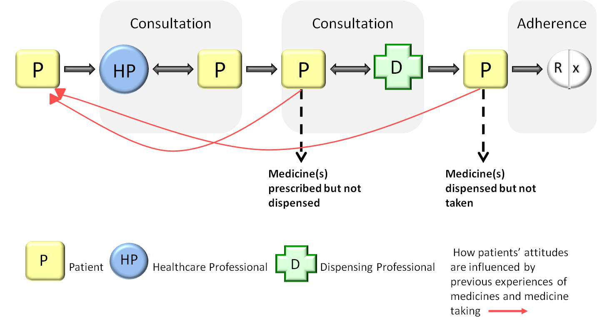

# Adherence and Concordance

## Misc bits to pop somewhere

Always consider the risks of re-initiating treatment - does it need re-titration?

## Checklist of Basic Measures

| Action | How |
| --- | --- |
| Take time to explain to your patient... | Why they need the treatment What time they should take it How often they should take it How many doses they should take What they should do if they miss a dose |
|Explain the importance of taking the medicines as prescribed | What could/will happen if the patient does not take it That the drug may not work - particularly if your recommendations are not followed That the drug could cause adverse-effects and that these may be mild or very harmful That drug interactions may occur when more than one agent is taken That a particular medicine should be taken at the same time every day as recommended That medicines should be taken with meals (where appropriate) or other daily events That some medicines require monitoring to avoid adverse effects and ensure a therapeutic effect is maintained Stress the importance of attending such appointments (e.g. oral anticoagulation) |
| Make suggestions| Link taking a dose of the medicine with an unrelated but regularly undertaken activity (e.g. brushing teeth) Use special pill boxes that help track medicines use (divided into sections for each day of the week and/or times of day) Ask for reminders of when to take their medicine from people close to them Keep a ‘medicine calendar’ near to the medicine (on which they note the times of doses) Use reminder notes on medicine cabinets or other convenient devices (such as the refrigerator where applicable) Download a medication reminder app to their smartphone or tablet |

## Session Key Points

- Non-adherence is widespread and has serious consequences for the health of individuals and significant resource implications for the NHS
- Non-adherence is described incorrectly in various ways and must be viewed as a dynamic and changeable behaviour
- There are many reasons for non-adherence, classified by the World Health Organisation (WHO) as social/economic factors, therapy-related factors, condition-related factors, patient-related factors and health system factors
- Shared decision-making between yourself and the patient is crucial in promoting adherence
- It is difficult to assess adherence in clinical practice
- There are a variety of simple strategies you can adopt that can promote both shared decision-making and adherence

## Adherence

> "The extent to which the patient's behaviour matches agreed recommendations from the prescriber"

(NICE Guidance [CG 76])

Importance of:

- a concordant approach between the prescriber and the patient
- the need to avoid considering non-adherence as a dysfunction of the patient)
- supporting the patient after the medicine has been dispensed

### Intention

| Type | The patient... | Improve by |
| --------- | --------- | --- |
| Intentional | ...makes a conscious decision not to follow treatment recommendations  | Is the patient experiencing any adverse effects? Is the patient finding the treatment ineffective? Has their opinion of the treatment changed? If so, why? |
| Unintentional | ...wants to follow the treatment instructions but is prevented from doing so by certain factors | What are the logistics? Consider modified release formuations |

### Patient Pathway

"Escape routes" for non-Adherence in dotted lines

Consulations avoid this by giving opportunities to:

- consider behaviour and beliefs of the patient
- provide information
- confirm understanding
- agree a treatment plan

## ~~Compliance~~ Out-dated terminology

> "The extent to which the patient's behaviour matches the prescriber's recommendations"

[Haynes et al, 1979]

## Concordance

At the heart of concordance is a belief that the prescriber and the patient must come to an agreement regarding therapeutic decisions

Concordance between patient and prescriber is more likely to result in adherence with the prescriber’s recommendations

| Factor | Action |
| --------- | --------- |
| Knowledge | Education to empower management of own health Provide information about **condition**, available treatments, risk and benefits  Tailored, Accurate, Clear and Accesible information |
| Partnership | Invite patients to talk about treatments Fully explain treatment Come to joint agreement and understanding of treatment Check understanding and ability to follow |
| Support | Regular Medicines review Discuss medicines and administration Address practicalities Share information with other healthcare professionals |

## WHO reasons

| Reason | Comment |
| --------- | --------- |
| Social/economic |  Age (Adults>Older People>Children>Adolescents) Gender Level of socioeconomic deprivation Ethinicity |
| Therapy | Time to benefit from treatment Adverse effects Complex regimens |
| Condition | The level of disability associated with the condition (if any) The rate of progression of the condition The severity of the illness The severity of any symptoms|
| Patient | Low motivation Anxieties about possible adverse effects Perceptions of a lack of need for the treatment Fear of dependence (even when this is pharmacologically impossible) |
| Health system | Insufficient time and quality of consultations and information |

## Promote shared decision making

### Health Professional-Led Interventions are best when

- They target specific illness groups
- There is adequate patient demographic/psycho-social profiling
- Sympathetic approaches are taken to patient:
  - Beliefs
  - Expectations
  - Preferences
  - Lifestyles
- Improvements in outcomes have statistical power
- Definitions of adherence are clinically appropriate
- Measures of adherence and health outcomes are relevant and robust
- Resources for the intervention are appropriate and relevant

remember:

- You will need to accept that patients may well hold different views to yourself and other healthcare professionals about the treatment
- As long as they have the mental capacity, patients have the right to decide not to take a medicine
- However, if you believe such a decision could be harmful, this should be recorded and you should provide information on the risks and benefits of not taking the medicine

| Consideration | Improve by |
| --------- | --------- |
| Improve Communication | Adapt your consultation style to their needs Consider any factors (e.g. disability) which may affect communication Ask open-ended questions, which will allow them to express any concerns Encourage them to ask questions Consider the use of communication aids|
| Increase Patient Involvement | Explain the condition Explain the advantages and disadvantages of treatment Avoid assumptions about patients' preferences Avoid any non-verbal cues (signs of apprehension, disagreement etc) Assist your patient in making decisions based on likely benefits and risks rather than misconceptions|
| Understand Patient Perspective | Consider their understanding of their condition, opinion on the need for medicine and concerns about medicine At all opportunities elicit and address any concerns your patient may have Ask what they know and believe about their medicines and their need for a medicine Most people want to reduce the number of medicines they take Explain the consequences of failing to take the medicine Explore non-pharmacological alternatives and suggestions to enable the patient to fit medicines-taking into their daily routine|
| Provide Information | Before you finish the consultation, ensure your patient has all the information they desire and check that they have understood Suitable information which is tailored to meet their needs What the medicine is and how to use it The likely benefits of treatment Any adverse effects and the likelihood of these occurring What to do should any adverse effects occur (this is particularly important in instances where immediate cessation of medicine-taking could result in harm to the patient e.g. beta-blockers, MAOIs) What to do if they miss a dose Expected duration of treatment (will another prescription be needed?) |

## Promote adherence

### Assessing Adherence

| Strategy | Comment |
| --------- | --------- |
| Subjective ('indirect') | Patient self-reporting However, interpreting such reports is often problematic Patients who 'admit' to not following recommendations tend to describe their behaviour accurately Patients who deny a failure to follow treatment advice have a tendency to report their behaviour inaccurately|
| Objective ('direct') | Practical in the research/clinical trials setting Therapeutic Drug Monitoring (i.e. a marker or metabolite) in a bodily fluid (i.e. blood or urine) Electronic monitoring devices that record the date and time when a medication container is opened have also been used to estimate adherence but the expense of these measures precludes their widespread use|

### In a consultation

> An opportunity to ascertain whether your patient needs more information or support

> Always remain non-judgemental

Ask your patient if they have missed any doses recently ("How many tablets have you missed in the last week?").

This will be made easier for your patient if you:

- Ask in a way that does not apportion blame.
- Clearly explain why you are asking.
- Mention a specific time (such as in the past week).
- Ask about habits (i.e. do they always take the medicine with their morning cup of coffee?)
- Use prescription records, pharmacy patient medication records and the return of any unused medicines to identify non-adherence.

### Cochrane Review

Interventions to enhance adherence to long-term treatments are often complex and even the most effective interventions do not lead to large improvements in adherence or in treatment outcomes.

Such interventions include:

- Simplification of the medication regimen
- Counselling
- Reminders
- Close follow-up
- Supervised self-monitoring
- Rewards for success
- Family therapy
- Couple-focused therapy
- Psychological therapy
- Crisis intervention
- Manual telephone follow-up

### Practical Problems

| Action | Example |
| --- | --- |
| Encourage your patient to monitor their condition | Blood glucose readings in conjunction with antidiabetic medication |
| Simplify the dosing regimen |Sswitching from a thrice daily regimen to an once-daily regimen by changing to a modified-release dosage formulation |
| Change the formulation | Switching to dispersible or orodispersible tablets in those with dysphagia |
| Change the device | Switching to a breath actuated inhaler in a patient who is unable to coordinate breathing and actuation with a pressurised metered dose inhaler |
| Suggest using a Monitored Dosage Systems (MDS) | Medidos® or Dossette® However, there is little published evidence to support using an MDS Therefore, a MDS should be restricted to use in those with specific, practical problems that impair adherence |
