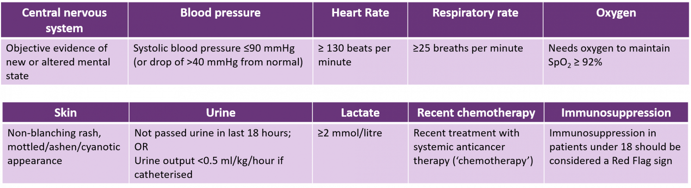

# Sepsis

|Question|Pre-Answer|Other options|Reading|Final|
|---|---|---|---|---|
|Initiating Abx|Abx within 1 hour|Abx within 2 hrs Abx after senior review| 1hr | 1hr |
|Sepsis Six Care Bundle| 500ml bolus | 4-6L NaCl 0.9% 4hr 20-25ml/kg/day of NaCl 25-30ml/kg/day of NaCl Fluid bolus of 500ml within first hour | 500ml bolus | 500 ml fluid bolus |
| Route of Abx | IV for at least 48 hours | IV abx for at least first 48 hours 1st IV then orally if available Patient can be commenced on oral | IV for at least 48 hours | IV for at least 48 hours |
| Cryptic Shock | two signs of inflammatory response but no raised temp | High lactate in with normal BP Purpuric rash but no systemic inflammatory response two signs of inflammatory response but no raised temp | High lactate in normal BP | High lactate in normal BP |
| 75 yr old abx | 1st full dose | check renal fx 1st dose full then renal doses nephrotoxic are contraindicated | 1st full dose | 1st full dose |
| NEWS2 Sepsix six | Two or more | None care bundle on NEWS2 One Two or more Three or more | One | One |
| NEWS2 statements | clinical deterioration over time | ~~5-6 high clinical risk~~ ~~score of 3 in individual paramerter is high clinical risk~~ adults and young people 12 and older assess clinical deterioration over time ~~CVPU acronymn conciousness, voice, pain, unresponsive~~ | clinical deterioration over time | clinical deterioration |
| Oxygen | maintain % | maintain 94-98% or 88-92% at risk hypercapnic respiratory failure 2L/min via nasal speculae 4L/min via hudson mask 15L/min via simple face mask | maintain % | maintain % |
| Cultures | 2 cultures treatment should not be delayed | single culture prior to abx single culture after first dose at least 2 cultures before abx at least 2 cultures after first dose at least 2 cultures, but treatment should not be delayed | 2 cultures treatment should not be delayed | 2 cultures tx not delayed |
| Septic shock | Refractory Hypotension | Acutely altered mental state Blood glucose > 7.7 mmol/L with no diabetes Refractory Hypotension Lactate >2mmol/L  O2 sats less than 91% | Lactate | Refractory Hypotension |

## Learning Outcomes

- Discuss the spectrum of infection and continuum of sepsis.
- Use evidence-based reputable action tools to help you screen patients for their risk of sepsis.
- Recognise the signs of sepsis and identify whether the patient is at high or moderate risk of sepsis.
- List situations where patients may not manifest the traditional signs and symptoms of sepsis.
- Discuss the factors to consider when prescribing for the patient with sepsis.
- List the six elements of the Sepsis Six® Care bundle and the timeframe in which these should be administered.
- Discuss good antimicrobial stewardship relating to the management of sepsis.
- Discuss the ongoing management of the patient with sepsis, including the importance of source control.

## Definitions

Sepsis, put simply, is the body's response to infection. The body's own inflammatory response is triggered by an infective agent and begins to affect the organs and tissues.
 
Sepsis is a continuum and if left untreated can lead to death. For sepsis to be present there must be infection; this could be due to bacteria, a virus, fungus, parasite or any other infective agent.

## Key Points

- Failure to treat sepsis quickly and appropriately can lead to considerable morbidity or even death.
- Use of the Sepsis Six® in 'Red Flag' sepsis and septic shock can reduce mortality.
- It is important to escalate care early to senior staff, including Critical Care and Outreach.
- Adhere to local antimicrobial prescribing guidelines and take into account any patient contraindications (e.g. allergy) when selecting treatment.
- Prescribe intravenous antimicrobials for the management of 'Red Flag' sepsis. Review the prescription and switch to the oral route once the patient is stable.
- Regularly monitor patients' renal function. Impairment can occur with sepsis and may improve with treatment, necessitating dose adjustment.
- One of the most common causes of missed or mismanaged care of the patient with sepsis is poor communication. Thoroughly document treatment plans and ensure effective handover.

## Recognition and diagnosis

### NEWS2

Early assessment of vital signs using the National Early Warning Score (NEWS)2, or alternative validated score, is vital to identify clinical risk, and therefore any deterioration over time.

ACVPU: Alert Confusion Voice Pain Unresponsive

### Red Flag Sepsis

### Amber Flags

- Relative(s) concerned about mental status
- Acute deterioration in functional ability
- Immunosuppressed
- Trauma/surgery/procedure in the last eight weeks
- Respiratory rate 21-24 breaths per minute
- Systolic blood pressure 91-100 mmHg
- Heart rate 91-130 or new dysrhythmia
- Temperature < 36°C
- Clinical signs of wound infection

#### Effect of underlying conditions

- Prescription of certain medications, such as beta-blockers, can mask the tachycardia associated with an inflammatory response.
- Recent use of paracetamol can reduce a fever.
- There is a condition called ‘cryptic shock’ where patients can have a high lactate concentration in the presence of a normal blood pressure. These patients may have sepsis and require urgent treatment.
- Conversely, some patients can have sepsis-induced hypotension without a raised blood lactate concentration. This can be associated with a lower mortality and less organ dysfunction.
- Some patients with COPD may have resting tachypnoea due to underlying pathology. However, in an acute setting, if the baseline respiratory rate for a patient is unknown, it is always safer to consider sepsis in a patient with a respiratory rate ≥25 breaths per minute

## Risk Factors

- Persons at the extremes of age (e.g. the very young and the very old).
- Those who are unwell.
- Those who are pregnant or have recently delivered.
- Patients who've recently experienced surgery or undergone trauma (within the last 6 weeks).
- Patients who are neutropenic or immunocompromised.
- Patients who are receiving treatment with cytotoxic medicines or systemic anticancer therapy.
- A person who has had an iatrogenic procedure.
- Anyone with an invasive line in-situ.
- Malnourished persons.
- Anyone with compromised organs or chronic conditions.

## Types of Sepsis

### Puerperal Sepsis

Infection of female genital tract, uterus.

Caused by:

- bacterial endometritis
- mastitis
- urinary tract infection
- pneumonia
- skin and soft tissue infection

Risk factors:

- Close contact with Group A Streptococci
- Prolonged rupture of membranes
- Diabetes/gestational diabetes

### Paediatric Sepsis

In the very young, the only sign of sepsis may be floppiness and/or irritability. Other signs include vomiting, rashes, tachypnoea and convulsions. Often the urine output drops, with children not urinating and fewer or no wet nappies.

### Neutropenic Sepsis

Causes of neutropenia:
 
1. An underlying condition or recent treatment with an immunosuppressant or systemic anticancer therapy.
2. The sepsis itself has caused neutropenia due to destruction of neutrophils by the infecting microorganism.

> Finding a source of infection can be difficult due to a lack of localising signs. Neutrophils are required to make pus, and so there may be no signs on a chest X-ray or erythema around a wound.

## Treatment

### Sepsis Six Care Bundle

Within one hour of presentation:

1. Arrange senior review
2. Administer O2
    - target 02 saturations of 94-98%. If at risk for hypercarbia - aim for saturations of 88-92%
3. IV access and bloods
    - Take at least two sets of blood cultures. Do not delay giving antimicrobials to obtain blood cultures.
    - Take blood glucose, lactate, FBC, U&Es, CRP and clotting.
    - Lumbar puncture if indicated.
4. Give IV Abx
    - Prescribe intravenous antimicrobials first-line in patients with suspected Red Flag sepsis or septic shock. This is vital to ensure that the antimicrobial reaches the systemic circulation and the organs and tissues as soon as possible. 
    - Consider patient allergies when selecting the antimicrobial.
    - [Start SMART then FOCUS](6_Prescribing_in_infection)
    - All patients should receive a full first (loading) dose of each antimicrobial agent, and within one hour of the diagnosis.
    - Renal function:
        - Studies show that 32-48% of cases of AKI are due to sepsis.  
        - Dose adjustments based on renal function are therefore likely in a patient with sepsis.
        - All patients should receive a first full loading dose of each antimicrobial agent, irrespective of renal function.
        - Adjust subsequent doses according to renal function.
    - clues about likely organisms
        - recent travel and hospitalisation
5. Give IV fluids
    - Give fluid bolus of 20 ml/kg if age <16, 500ml if 16 years and over
    - NICE recommends using lactate to further guide fluid therapy
6. Monitor
    - Use NEWS2
    - Measure urinary output, this may require a urinary catheter.
    - Repeat lactate at least once per hour if initial lactate elevated or if clinical condition changes

### Focussing Treatment

#### Patient review

- Review all patients with sepsis after an hour, and regularly to ensure that the treatment is working and that the source of sepsis is under control.  
- Communicate with nursing staff about the frequency of vital observations and escalating any deterioration. If your Trust uses electronic observations to calculate early warning scores, ensure the results are added to the system as soon as they are taken, and not delayed until the end of the observation round. This can delay the recognition of deterioration.  
- Patients may initially get better and then deteriorate, either due to a lack of source control or overwhelming sepsis. Lack of planned review can mean that this deterioration is missed, which can result in death for the patient.
- If you cannot review a patient with sepsis due to workload, or your shift ends before a review is due, effectively handover the patient to a colleague for review.

#### Prescription Review

> At 48-72 hours, review the patient and document the management plan, including the next review or stop date.

- Drug
  - Check culture sensitives and response to treatment-a switch may be necessary:
  - Stop treatment (i.e. if no evidence of infection).
  - Switch antimicrobials from the intravenous to the oral route.
  - Change the antimicrobial (i.e. based on sensitivities).
  - Continue current treatment.
  - Refer for Outpatient Parenteral Antibiotic Therapy (OPAT).
- Dose/frequency
  - As the sepsis resolves, so too can the renal impairment. Monitor this throughout treatment so that you can increase the dose of the antimicrobial according as it begins to improve. Failure to do so could lead to under-dosing, and put the patient at risk of deterioration.
- Route
  - Once sepsis begins to resolve and the patient stabilises, it is good antimicrobial prescribing practice to consider an intravenous to oral switch. By this time microbiology results should be available to guide your choice of treatment so that you can 'focus' on-going treatment.

#### Communication 

SBAR to handover