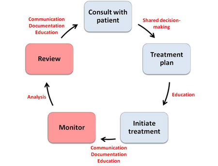
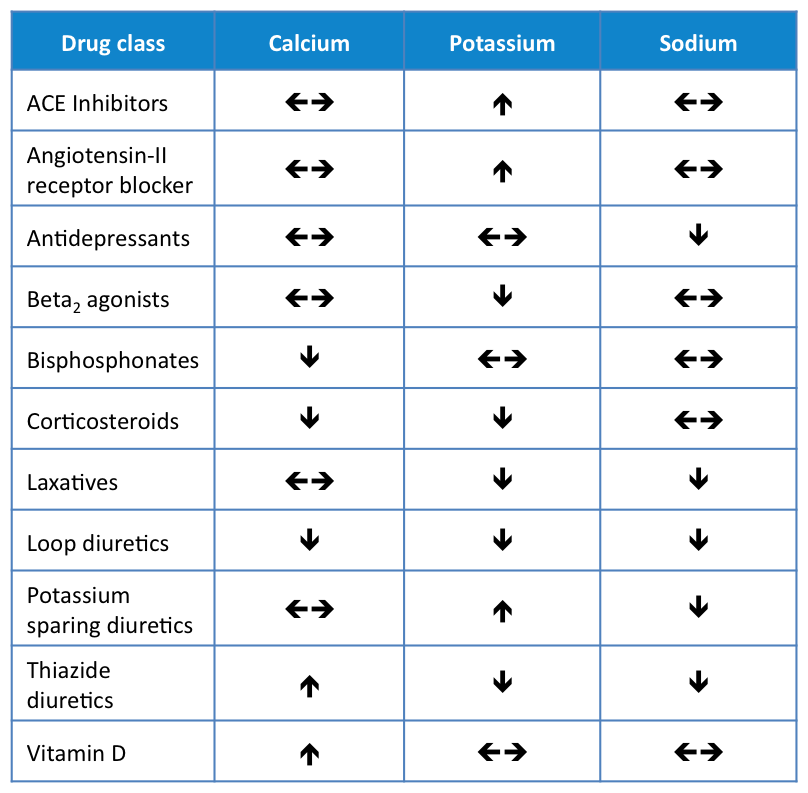

# Drug Monitoring

| Question | Options | Pre-response | Reading | Final |
| --- | --- | --- | --- | --- |
| Subjective monitoring is useful, but cannot form the basis of decisions, need support of objective definitive measures | T F | T | T | F Not every drug will have objective measures|
| HbA1c in Adult Type 1 diabetes | every month 3-6 mo 6 mo 6-12 mo annually | Annually | 3-6 mo | 3-6 mo |
| Pulmonary Toxicity | Amiodarone Isotretinoin Lithium Sulfasalazine Vanc | Isotretinoin | Amiodarone | Amiodarone |
| Most likely to increase plasma-theophylline | Dietary Na increased ETOH Starting Warfarin Stopping Smoking Starting Carbamazepine | Stopping Smoking | | Stop Smoking |
| Prophylactic Trimethoprim Red Flag | Cough Constipation Muscle Weakness Sore Throat Tiredness | Muscle Weakness | Sore Throat | Sore Throat Blood disorders (fever, rash, ulcers, bruising) |
| Asthma Review correct statement | Hypertension is persistent BP >120/80 If first reading >140/90 then no need for repeat confirmation BP on both arms and if greater than 15 then higher value used If postural hypertension then BP reading whilst standing If 2nd is substantially different then take higher reading | Third statement | | Third option |
| Routine TDM required | IV gent 120mg stat IV vanc 1d bd Oral Azathiopine 100mg od Oral digoxin 62.5microgram od Oral vanc 125mg qds | IV vanc | | IV vanc |
| Gradual titration and monitoring to prevent rashes Steven-Johnson, toxic epidermal necrolysis | Diazepam Lamotrigine Levodopa Pizotifen Sumatriptan | Lamotrigine | | Lamotrigine |
| Cosmofer | Test dose for first treatment Test dose for every treatment Atopic patients monitored for 15 mins following tx All patients monitored for 30 mins following tx Repeated option | 30 mins following | | 30 mins following |
| Depakote shared care raised LFTs | stop liver ultrasound compare to baseline LFTs first stop, repeat LFTs, restart if ok | compare to baseline | | Baseline |

## Learning Outcomes

- Discuss why it is important to monitor drug therapy.
- Identify the commonly prescribed drug therapies that require monitoring before, during and after treatment.
- Describe the strategies for monitoring drug therapy, and the criteria that will determine whether a strategy is clinically acceptable.
- Identify common drugs that require Therapeutic Drug Monitoring (TDM) during treatment to avoid sub-therapeutic plasma concentrations or toxicity.
- Know where to access information on the recommendations for monitoring drug therapy.

## Key Points

- Patient safety incidents occurring as a result of a failure to monitor are completely avoidable.
- Tests for monitoring both adverse and beneficial effects should be safe, simple, precise, and validated.
- Monitoring should be acceptable to treated patients.
- You should have defined a plan of action for both normal and abnormal results.
- When interpreting results, consider the patient and what is 'normal for them'.
- Any intervention made in response to abnormal results should be evidence-based and effective.
- Therapeutic Drug Monitoring (TDM) is necessary for drugs that have a 'narrow' therapeutic window, i.e. where there is a potential for toxicity with small dose adjustments. This is particularly true if there is considerable inter- and intra-patient variability in the dose-response relationship (e.g warfarin).

## Drug Table

| Drug | Tests | Maintenance | Dose adjustment |
| --- | --- | --- | --- |
| Levothyroxine | TFTs | Annually | 6-8 weeks after dose adjustments |
| Amiodarone | TFTs | Every 6 months | |
| Combined Oral Contraceptive | BP | Every 6 months | |
| Digoxin | Heart Rate | During initiation/hospitalisation | |
| Methotrexate | FBCs | Two weeks for two months monthly for four months three monthly thereafter | |
| Vitamin D | plasma 25-hydroxyvitamin D calcium |   |  after one month |

## Therapeutic Management Planning

| Benefits to patient | Benefits to NHS/Public |
| --- | --- |
|Encourage patient adherence Allow patients to achieve treatment targets Reduce adverse drug effects Increase patient confidence in your treatment and in the healthcare system | The effective use of health service resources A reduction in hospital admissions as a result of Adverse Drug Reactions (ADRs) A reduction in length of hospital admissions A reduction in GP appointments |

### Do's and Don'ts

| Do's | Donts |
| --- | --- |
| Document the time of the last dose. Take the sample at the correct time. Document the time of sampling. Follow-up the results. Document the result in the medical notes. Adjust treatment accordingly.| Don't monitor the serum concentration of digoxin unless toxicity is suspected. Don't ignore a concentration that is within the reference range if the patient shows signs of toxicity. Don't ignore a concentration that is within the reference range if there is an inadequate response. Don't assume adherence. If the concentration is found to be low, check that the patient has been receiving the dose as instructed. This will avoid any unnecessary dose increases, with a potential for toxicity if the patient suddenly becomes adherent. |

### Effects on Electrolytes

## References

- Coleman. JJ, Ferner. RE, Evans. SJ. Monitoring for adverse drug reactions. British Journal of Clinical Pharmacology (2006); 61(4):371-8
- Coleman. JJ, Aronson. JK, Ferner. RE. Monitoring for the adverse effects of drugs. In: Evidence-based Medical Monitoring: from Principles to Practice. Glasziou PP, Irwig L, Aronson JK (Eds). Blackwell Publishing; Oxford (2008).
- Cousins, D. H., Gerrett, D. and Warner, B. A review of medication incidents reported to the National Reporting and Learning System in England and Wales over six years (2005-2010). British Journal of Clinical Pharmacology. (2012); 74(4):597-404
- Ferner. RE, Coleman. J, Pirmohamed. M, Constable. SA, Rouse. A. The quality of information on monitoring for haematological adverse drug reactions. British Journal of Clinical Pharmacology (2005); 60: 448-51.
- General Medical Council (2013). Good practice in prescribing and managing medicines and devices. Available online at www.gmc-uk.org/guidance/ethical_guidance/14316.asp
- Pirmohamed M, Ferner RE. Monitoring drug treatment. BMJ (2003); 327: 1179-81.
- Summary of Product Characteristics. Available online at www.medicines.org.uk