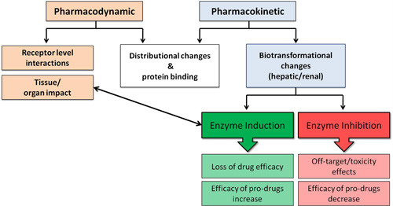

# Drug Interactions

| Question | Options | Pre-response | Reading | Final |
| --- | --- | --- | --- | --- |
| Not inhibitor/inducer p450 | Phenytoin Rifampicin Nifedipine St John's Wort Carbamazepine | Nifedipine | | Nifedipine |
| Drug-food interactions | Alcohol enchancing paracetamol cranberry juice decrease warfarin oral iron reduce absorption cipro MOAi and tyramine rich foods reduced BP Food aids ibuprofen absorption | oral iron | | oral iron |
| pharmacodynamic mechanism | ibuprofen and warfarin Rifampicin and oral contraceptive ranitidine and antacids colestyramine and metformin omeprazole and clopidagrel | ibuprofen and warfarin | ibuprofen and warfarin | ibuprofen and warfarin |
| least likely to be significant | digoxin and warfarin amiodarone and warfarin warfarin and diclofenac verapamil and digoxin warfarin and rivaroxaban | digoxin and warfarin | | digoxin and warfarin |
| most likely to interact with combined oral contraceptive | amoxicillin cefalexin erythomycin metronidazole rifampicin | rifampicin | rifampicin | rifampicin |
| cigarette smoke | inhibit CYPs induce CYPs induce P-glycoprotein | induces CYPs | induces CYPs | induces CYPs |
| pharmacokinetic interactions when... | two drugs with similar or antagonistinc pharmacological effects one drug affects ADME of another | ADME | | ADME |
| st John's Wort | increase theophylline conc caused organ rejection when given with ciclosporin increased INR with warfarin increased sedation with zopiclone | increased theophylline | organ rejection (inducer) | organ rejection with ciclosporin |
| Gender correct | Females clear drugs slower Females oral contraceptive less effective if taking phenytoin Females clear ETOH more rapidly Females less susceptible to drug induced torsades des points | Phenytoin | | Phenytoin |
| metronidazole for PID | avoid alcohol during avoid alcohol during and 48 hours after avoid grapefruit juice avoid grapefruit juice during and 48 hours after avoid tyramine containing foods | avoid alcohol during | | Alcohol during and 48 hours after |

## Learning Outcomes

- Demonstrate knowledge of potential drug-drug interactions (DDIs) mechanisms (pharmacodynamic and pharmacokinetic).
- Describe patient factors that may intensify drug-drug interactions, related to age, sex, metabolising enzyme profile (sometimes related to ethnicity), disease, diet, smoking and illicit drug use.
- Describe some of the common drug interactions seen in clinical practice and strategies for minimising their occurrence.
- Find information on potential drug interactions.
- Highlight the importance of identifying and reporting 'suspected' drug interactions and Adverse Drug Reactions (ADRs) to the Medicines and Healthcare Products Regulatory Agency (MHRA).

## Key Points

- Drug interactions are common.
- Drug interactions can be divided into pharmacodynamic and pharmacokinetic interactions.
- Drug interactions can be unpredictable in clinical outcomes.
- Many interactions are preventable.
- Certain patient groups are more at risk of drug-drug interactions.
- Drug interactions should be reported to the MHRA's Yellow Card scheme.

## Risk Factors

| Risk Factor | Impact | Example |
| --- | --- |
| Older age | Increasing age is associated with increased drug use. Age-dependent changes in composition and function of the body can alter the pharmacokinetics and pharmacodynamics of a drug. This increases the risk of ADRs, and drug-drug interactions in the older adult patient. Co-morbidities puts the older patient at risk of medicine-related problems. |
| Neonates and children | Neonatal (28 days old or less) hepatic function is too modest to eliminate most drugs and this, coupled with immature renal function, means that they are especially vulnerable to drug accumulation and toxicity. Toddlers and older children show rapid improvements in the elimination of some drugs, but not others.|
| Gender | The female sex generally eliminate drugs from their bodies more rapidly than males, although drugs often distribute in females differently, according to the individual agent and its chemical properties. The female sex are more subject than males to some serious drug adverse-effects such as torsades des points and some severe idiosyncratic (no known cause) drug reactions.|
| Polymorphic enzyme expression | A tiny number might clear it very quickly, the majority (the ‘wild type’) might clear a drug quickly, an intermediate group more slowly, whilst a small minority, usually less than 10%, will clear the drug very slowly. This effect is more apparent in some ethnic groups than others with respect to particular enzymes and the drugs they clear. For example, clopidogrel is much less likely to be clinically effective in those of Chinese/Japanese/Korean ancestry, as these groups exhibit a poorer expression of the enzyme that activates the drug compared with other ethnic groups. |
| Co-morbidities |Comorbidities can increase the risk of drug interactions. For example, liver failure or malnutrition can lead to reduced albumin levels, leading to changes in the availability of protein bound drugs. Liver and renal dysfunction will, together or separately, cause most drugs to accumulate in the patient, leading to potentially severe toxicity. |
| Diet | Patients may ingest foods and beverages that contain chemicals that can have marked effects on drug absorption as well as biotransformation. |
|Smoking|Smoking causes accelerated removal of some drugs from the body and since smokers are under constant pressure to stop for health reasons, they may be stabilised on a drug regimen, which may then become sub-optimal if they change their smoking habits.|
|Alcohol and illicit drugs | There are several instances of alcohol causing marked DDIs. Whilst acute ingestion may impact on the effects of warfarin and metronidazole, chronic alcohol use can impact on the liver’s ability to maintain homeostasis and can eventually reduces the clearance of almost all drugs. Chronic use of inhaled agents such as cannabis may cause similar effects as nicotine on the clearance of some drugs. Cannabis can promote severe tachycardia in patients prescribed tricyclic antidepressants and anticholinergic drugs. Amfetamines can lead to serotonin syndrome with SSRIs. The respiratory effects of heroin are accentuated by benzodiazepines and other opiates.|

## Classification

| Pharmacodynamic | Pharmacokinetic |
|---|---|
|In pharmacodynamic interactions, drugs amplify or negate each other's pharmacological effects. These interactions occur at the level of the receptor, tissue, and organ. The timeframe and persistence of these interactions will be directly linked to the half-lives of the respective agents in the patient. Drug concentrations may remain within the therapeutic window, yet toxicity or complete lack of efficacy may result. In addition, pharmacodynamic interactions may cause 'off-target' effects which impact the patient, but were not intended by the drug manufacturer or the prescriber.| Pharmacokinetic interactions occur when one drug, dietary or herbal chemical, impacts on the biotransformation of a drug, or even their distribution within the body. The term 'biotransformation' covers the conversion of drugs into metabolites, which makes them more soluble in water. This facilitates excretion of the metabolites. The term 'metabolism' is also used, but this is a much broader term that can apply to many non-drug related enzymatic activities in the body. |
| Ototoxicity with loop diuretics and aminoglycosides | Rifampicin and Combined oral contraceptives |

### Enzyme Inducers and Inhibitors

| Inducers | Inhibitors |
| --- | --- |
| Cytochrome P450 induction begins within hours of administration of an enzyme-inducing drug and may not be complete until 2 to 3 weeks after the start of therapy. As the process proceeds, the drug concentration will fall out of the therapeutic window, necessitating active dose increase to maintain clinical effect. After two or more weeks maximum CYP production will be achieved, and a stable dose reached. This can be at perhaps 5 or even 10 times the starting dose, to yield exactly the same plasma-drug concentrations. Within days of ceasing an 'inducer' drug, the inductive effect is lost. Significant breaks in drug therapy, perhaps a few days or a week, put patients' at risk of 'overdose' if re-commenced on their previous fully 'induced' dose. If drug entry to the body is constant, then accelerating drug removal through increased biotransformation will cause premature loss of the drug and reduce or even abolish efficacy - in spite of the patient continuing to take the correct dosage. This is known as  induction of biotransformation and its timeframe is **days and weeks.** | Drug simply accumulates within the body, leading to an intensification of pharmacological effects, as well as off-target pharmacological effects. If the drug concentration continues to rise, frank toxicity will result. Alternatively, if drug entry is constant and removal of the drug is inhibited, the resultant drug accumulation can lead to off-target effects and toxicity. The timeframe for this effect is **hours and days and can be an immediate threat** to patient health. |
| Rifampicin St John's Wort Phenytoin, carbamazepine and phenobarbital | Erythromycin/Clarithromycin permanent (need new enzymes) Azoles are reversible Grapefruit Juice Cranberry Juice |

### Protein Binding 

Drugs that are strong protein binders may displace other drugs from plasma protein, leading to greater free plasma concentrations, thus increasing the drug's availability to body tissues.

### Membrane Pump Systems

| Efflux Pumps | Influx Pumps |
| P-glycoprotein, which uses ATP to transport  many absorbed drugs straight back out into the lumen of the gut, thus retarding drug passage across the gut lining towards the portal blood supply. P-glycoprotein's protective role is seen where it is heavily over expressed in many tumours, which leads to resistance to anticancer drugs.| Influx of vital nutrients such as amino acids is accomplished by solute carriers, or SLC's, which includes the Organic Anion-Transporting Polypeptides (OATPs). Also transport into portal circulation allowing for metabolism Due to their resemblance to such dietary components, several water-soluble drugs, such as atorvastatin and the antihistamine fexofenadine, are only absorbed through these carriers Can be inhibited by Rifampicin leading to atorvastatin bypassing portal circulation and metabolism |

## Cytochrome P450 Enzyme System

### Role

- CYPs allow the manipulation of the structure of virtually any chemical, be it a drug or a toxin, and are present in most species.
- CYPs can change the shape of a molecule (for interactions with receptors) and its physicochemical properties (where the chemical dissolves).
- The CYPs allow the patient's liver to build hormones and other signal molecules, assembling them to the correct shape and properties.
- The CYPs also dispose of these molecules when they are surplus to requirements.
- Drugs and toxins are caught in this latter 'disposal' process, where they are metabolised from the form best absorbed and difficult to excrete (poorly water soluble) into more water soluble and hence easy to excrete metabolites. These latter forms can then be further metabolised in some cases by other enzyme systems that attach large water-soluble molecules to the drug (conjugation) which then accelerates elimination in urine.

## Herbal interactions

| Herbal treatment | Interactions |
| --- | --- |
| Garlic | Garlic inhibits platelet aggregation. There can be an additive effect when administered concomitantly with antiplatelets, and an increased risk of bleeding with anticoagulants. There are cases reports of haemorrhage associated with the use of large doses of garlic alone. In-vitro evidence shows a potential additive effect when administered concomitantly with warfarin. |
| Ginseng | Ginseng has some minor hypoglycaemic activity, although it is unlikely to cause major falls in blood sugar.
It therefore interacts with oral hypoglycaemic agents (e.g. gliclazide). |
| Glucosamine | Glucosamine interacts with warfarin. A number of reports have noted increases in the INR associated with the use of glucosamine. The Committee on Human Medicines (CHM) recommend co-administration with anticoagulants is avoided |
| St John's Wort | St John’s Wort interacts with antidepressants. The therapeutic effects of St John’s Wort with conventional antidepressants can increase the risk of serotonin syndrome or hypertensive crisis when prescribed with monoamine oxidase inhibitors (MAOIs). St John’s Wort induces the metabolism of warfarin causing a reduction in the INR. St John’s Wort reduces the concentration of oestrogen and progestogens, reducing contraceptive cover.|
| Liquorice | Liquorice can cause hypokalaemia and therefore increase the risk of digoxin toxicity if taken concomitantly. |

## References 

- Cytochrome P450 drug interaction table. Indiana University. Available online at www.medicine.iupui.edu/flockhart/
- Clinical Guidance: Drug Interactions with Hormonal Contraception. The Faculty of Sexual and Reproductive Healthcare (January 2017).  Available online at: https://www.fsrh.org/standards-and-guidance/documents/ceu-clinical-guidance-drug-interactions-with-hormonal/
- To find out more about drug interactions with HIV medication and to check for interactions visit  www.hiv-druginteractions.org
- Coleman M D. Human drug metabolism: an introduction. Second Edition; Wiley International, 2010; pp360. (ISBN 978-0-470-74216-7)
- Davies, E. C., Green, C. F., Taylor, S., Williamson, P. R., Mottram, D. R., Pirmohamed, M. (2009). Adverse drug reactions in hospital in-patients: a prospective analysis of 3695 patient-episodes. PloS one, 4(2), e4439.