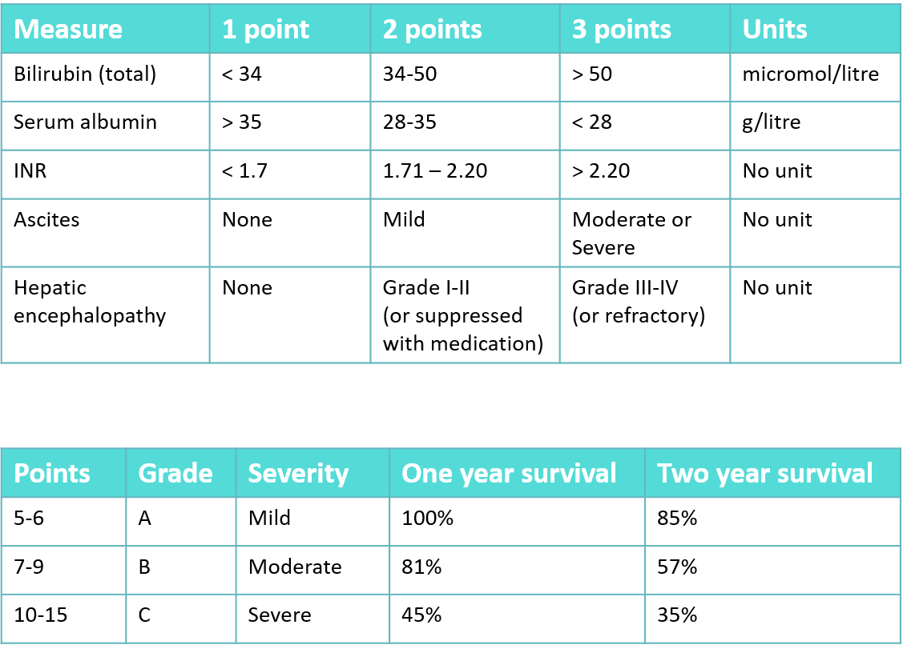

# Prescribing in Hepatic Dysfunction

| Question | Options | Pre-response | Reading | Final |
| --- | --- | --- | --- | --- |
| Antihypertensives contra in end-stage chronic liver | Beta-blockers Calcium Channel Blockers ACE inhibitors Diuretics | CCBs | ACEi | ACEi RAAS needed to maintain peripheral vascular resistance |
| Not cause drug induced liver injury | Ibuprofen Omeprazole Co-amoxiclav Isoniazid | Ibuprofen | Omeprazole | Omeprazole |
| Best evaluation of Liver Function | LFTs Albumin, PTT, Bili Child Pugh Score | Child Pugh Score | Child Pugh | Child Pugh |
| Decrease in first pass metabolism can: | increase oral bioavailability decrease oral bioavailability no effect on oral bioavailability | Increase | | Increase Expecially those impacted by first pass |
| diclofenac contra in severe liver, which statement doesnt apply | induces CYP 3A4 increases bleeding risk increases renal impairment risk reported to cause livery injury | induces CYP 3A4 | | No impact on liver enzymes |
| Child Pugh score - most severe liver dysfunction | Class A Class C | Class C | Class C | Class C |
| Fluclox can cause liver injury with single dose | True False | True | True | True |
| Drug induced liver injury can affect metabolism of other drugs | True False | True | | True |
| Collateral shunts to liver can lead to: | Increased first-pass decreased first-pass | increased | decrease blood diverts | decrease blood bypasses liver |
| Risk assessment for acetylcysteine treatment | Alcoholism Anorexia Liver Enzyme Inducers None of above | None of above | None of above| None of above |

## Learning Outcomes

- Apply the principles of safe prescribing in patients with hepatic dysfunction.
- Discuss the effect of disease in hepatic dysfunction when prescribing.
- Describe the important adverse effects of commonly prescribed drugs on the liver.
- Describe the metabolism of drugs by the liver.
- Know the effect of some drugs on liver metabolism.
- Rationalise drug treatments in hepatic dysfunction and make dose adjustments where necessary.
- Know where to access up-to-date and reliable information on the prescribing of drugs in hepatic dysfunction.

## Key Points

- Many commonly prescribed drugs can cause harm in chronic liver disease.  Always prescribe with care in these patients.
- A patient’s liver function can be assessed using the Child Pugh score.
- Drugs can cause an idiosyncratic liver injury.
- Paracetamol can cause acute liver failure but this can be prevented by the appropriate administration of acetylcysteine.
- Many drugs are metabolised by the liver, and doses may need to be reduced in liver dysfunction.
- Oral bioavailability may be increased for some drugs in patients with portosystemic shunts.
- Drugs may induce or inhibit liver enzymes, and affect the metabolism of other drugs.

## Chronic Liver Disease

### Signs

- Spider naevi
- Clubbing
- Jaundice
- Loss of secondary sexual hair
- Gynaecomastia
- Ascites
- Splenomegaly
- Peripheral oedema
- Hepatomegaly

### Child-Pugh Score

## Drug Induced Liver Injury

Echinacea

| Drug | Details |
| --- | --- |
| Paracetamol | causes a dose-dependent acute liver injury that can lead to acute liver failure.|
| Co-amoxiclav and flucloxacillin|  can cause cholestatic hepatitis that resolves in most cases after withdrawal of the drug.|
| NSAIDs (e.g. ibuprofen, naproxen, diclofenac) | can cause an ideosyncratic hepatitis that resolves in most cases after withdrawal of the drug. Aspirin can also cause hepatitis but it tends to be dose related.|
| Antituberculosis drugs (e.g. rifampicin) | can cause liver injury.|
| Methotrexate | can cause severe fibrosis and cirrhosis if not adequately monitored.|
| Amiodarone | can cause a steato hepatitis.|

### Paracetamol 

150 mg/kg of acutely ingested paracetamol in less one hour can lead to liver damage in adults and it is the leading cause of acute liver failure in the UK

- Paracetamol is primarily metabolised in the liver and metabolism of paracetamol is required prior to hepatotoxicity.
- Liver injury does not occur until glutathione is depleted.
- After this, the reactive metabolites of paracetamol bind to cellular macromolecules, causing lethal damage to the hepatocyte.

The antidote to paracetamol poisoning is acetylcysteine, which augments glutathione levels.

Treating:

- plasma levels above treatment line
- Patients presenting after 8 hours who have taken potentially toxic amounts of paracetamol should commence acetylcysteine, even if plasma concentrations are not available.

## Drug Metabolism

| Phase | Actions |
| --- | --- |
| Phase 1 | renders the drug more polar by oxidation, reduction or methylation so it can combine with another molecule. The cytochrome P450 group of enzymes is responsible for the majority of Phase 1 reactions. In cirrhosis, the activity of these enzymes can be markedly reduced.| 
| Phase 2 | conjugation, which results in a water soluble compound that is usually inactive and more easily excreted in the urine or bile. Some mechanisms of Phase 2 reactions, e.g. glucuronidation and sulphation, have been shown to be impaired in liver disease.| 

Both phases can be affected by liver dysfunction, leading to a reduction in metabolism.  This reduced metabolism will require dose adjustment for some drugs.

If the blood flow through the liver is slowed, a drug may be subject to increased metabolism, as it may stay in the liver for longer.
 
However, patients with cirrhosis often develop collaterals, enabling the blood to bypass the liver, resulting in a  decrease in first-pass metabolism.
 
In patients who have developed these shunts, drugs which are usually subject to extensive first-pass metabolism, will have a higher plasma concentration than usual. These drugs would normally have a low oral bioavailability, but in advanced liver disease, this can increase up to 100%.  Drug concentrations can approach levels expected if the same dose was administered parenterally.
 
In such cases, you would need to prescribe reduced doses to avoid toxicity.

## Adverse Effects of Liver Disease

| Symptom | Affect on drug therapy |
| --- | --- |
| Encephalopathy | can occur in chronic liver disease. You will need to consider this when prescribing drugs that have the potential to: Cause sedation (e.g. benzodiazepines). Cause agitation (e.g. antipsychotics). Cause constipation (e.g. opioid analgesics). Cause electrolyte disturbances (e.g. diuretics).|
|Clotting Abnormalities | synthesis of clotting factors is reduced, leading to clotting abnormalities. You will need to consider this when prescribing drugs that have the potential to: Cause thrombocytopenia (e.g. sodium valproate). Increase the risk of bleeding (e.g. anticoagulants, antiplatelets).|
| Gastric and oesophageal varices | This is a complication of chronic liver disease, secondary to portal hypertension.  You will need to consider this when prescribing drugs that have the potential to:  Cause irritation to the gastrointestinal (GI) tract (e.g. NSAIDs). Increase the risk of bleeding (e.g. anticoagulants).|
| Ascites | Ascites can be precipitated by drugs that have the potential to:  Cause fluid retention (e.g. NSAIDs). Increase body sodium (e.g. sodium chloride infusion).|

## Prescribing in Hepatic Dysfunction

- Identify at risk patients.
- Monitor LFTs, albumin, pro thrombin time and bilirubin at baseline and at regular intervals throughout treatment with drug treatments known to cause hepatotoxicity.
- Monitor drug concentration where possible, to avoid toxicity which can cause liver injury.
- Avoid drug-drug interactions which may increase the risk of liver injury.
- Drugs that are dependent on the liver for metabolism are likely to need dose reduction.
- Drugs that increase the risk of bleeding should be avoided, or used with caution in hepatic dysfunction.
- Prescribe drugs that might exacerbate or precipitate the adverse effects of liver disease cautiously.

| Drug Characteristics | Effect | 
| --- | --- |
| Bioavailability | This gives an indication of the extent of first-pass metabolism. First-pass metabolism may be decreased in patients with liver dysfunction if portosystemic shunts are present. |
| Metabolism | Be cautious when prescribing drugs that are pre-dominantly metabolised by the liver in patients with liver dysfunction. |
| Half-life | The half-life of a drug can be extended in patients with liver dysfunction. |
| Protein Binding | Decreased serum albumin may lead to a decrease in total drug concentration for those drugs which are highly protein bound. However, the concentration of free (i.e. pharmacologically active) drug is generally unchanged.  Take care when interpreting the total plasma-concentration of these drugs. |
| Excretion | Does the drug undergo biliary excretion or enterohepatic circulation? If biliary excreted (e.g. ethinylestradiol), excretion may be reduced in some biliary conditions. |
| Adverse effects | The adverse-effects of drugs can exacerbate the effects of liver dysfunction.  For example, clotting abnormalities may be exaggerated by NSAIDs or antiplatelets. |
| Hepatotoxicity | Avoid hepatotoxic drugs where possible.  This will reduce the risk of further liver injury. |
| Nephrotoxicity | Avoid nephrotoxic drugs where possible.  Patients with chronic liver disease are at greater risk of renal dysfunction. |

## References

For information regarding dose adjustments in hepatic dysfunction:
 
- Joint Formulary Committee. British National Formulary (online) London: BMJ Group and Pharmaceutical Press. Available online  at https://bnf.nice.org.uk/
- Electronic Medicines Compendium. Summary of Product Characteristics. Available online at www.medicines.org.uk
 
For information regarding drug interactions:
 
- Joint Formulary Committee. British National Formulary (online) London: BMJ Group and Pharmaceutical Press. Available online at https://bnf.nice.org.uk/
- Medscape drug interaction checker. Available online at www.medscape.com/druginfo/druginterchecker
- Stockley's Drug Interactions (current edition).  Pharmaceutical Press. Available online via https://www.medicinescomplete.com/about/
