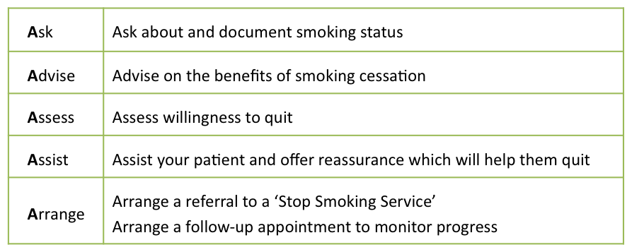

# Respiratory Medicine

| Question | Options | Pre-response | Reading | Final |
| --- | --- | --- | ---| --- |
| When prescribing O2 what needs to be stated | Target Sats Continuous or PRN Flow rate delivery device all of above | All of above | All of above | All of above |
| Spacer can be used with | pMDI breath actuated dry powder all of above | pMDI | | pMDI |
| Smoking cessation medication caution in psychiatric illness | bupropion NRT oral spray NRT patches Varenicline | Varenicline | Varenicline | Varenicline |
| Correct statement of acute asthma adults | Abx always Nebulisers driven by air IV MgSO4 when no response to nebs IV aminophylline for additional bronchodilation steroids for at least 10 days | MgSO4 | MgSO4 | MgSO4 |
| Decreases plasma theophylline levels | Stop smoking heart failure starting macrolide increase EtOH hepatic failure | increased EtOH | increased EtOH | increased EtOH |
| Inadequate control after 3months of inh corticosteroid and LABA, what to advise next | Continue stop LABA and increase steroid continue LABA and increase steroid start theophylline | continue LABA and increase steroid | | continue LABA and increase steroid |
| LTOT in COPD and PaO2 of less than | 7.3kPa 8.2kPa 9.0kPa 9.5kPa | 9.0kPa | 7.3kPa | 7.3 kPa |
| Target O2 sats of 88-92% in which | Adults with moderate exacerbation of asthma Adults with acute severe exacerbation of asthma Adults at risk of acute on chronic T2 resp failure Children presenting with acute exacerbation of asthma Pregnant and acute exacerbation of asthma | Adult moderate exacerbation of asthma |Risk of Acute on Chronic Type 2 resp failure | Acute on Chronic T2 resp|
| Correct re pregnancy | NRT patches OK in pregnancy and breastfeeding if unable to quit - other forms contraindicated Bupropion and varenicline can be prescribed if preg or feeding in unable to quit Withhold inhaled corticosteroids during pregnancy Leukotriene receptor antagonists to continue if required to achieve control of asthma Mothers with asthma who are feeding should avoid treatment | NRT | Not NRT, Buproprion Varenicline - is Leukotriene| Leukotriene |
| 65 year old, FEV1 60% FVC 110% FEV1/FVC 50%, ex-smoker SOB on exertion what to prescribe | Inhaled SABA Inhaled LA muscarinic Comb steroid and LABA Inhaled Steroid |Inhaled SABA | | Inhaled SABA (or SA antimuscarinic) |

70%

## Learning Outcomes

- Prescribe oxygen, safely in both the acute and long-term settings.
- Counsel patients about the options available for smoking cessation and prescribe appropriate nicotine replacement therapy.
- Describe the different devices available for delivering inhaled therapy, and be able to choose the most suitable device for your patient.
- Manage patients with both acute and chronic COPD and asthma.
- Choose appropriate management strategies for patients with common respiratory infections.

## Definitions

| Term | Meaning |
| --- | --- |
| Hypercapnic respiratory failure |  Patients who retain carbon dioxide may depend on hypoxia for their respiratory drive. In these patients high oxygen saturations will decrease ventilation and lead to raised CO2 and type 2 respiratory failure |

## Session Key Points

- [Right Breath website]( https://www.rightbreathe.com/)
- Oxygen is a drug and should be prescribed. Hypoxia and hyperoxia can be dangerous and should be avoided where possible.
- Encourage smoking cessation.  Both pharmacological and non-pharmacological methods of support are available for people who want or are willing to quit.
- Choose the most appropriate inhaler device and ensure good inhaler technique to achieve optimal therapeutic benefit.
- Manage chronic asthma using the British Thoracic Society (BTS) protocol, adding in medication as required to attain and maintain optimal symptom control. Acute asthma can be life threatening and requires prompt treatment.
- Management of Chronic Obstructive Pulmonary Disease (COPD) is guided by both subjective factors (dyspnoea, quality of life scores) and objective factors (lung function and blood gases). Acute exacerbations of COPD should be carefully managed to prevent further deterioration.

## Oxygen

### Prescribing

Prescriptions need to specify:
- Target oxygen saturation.
- Whether oxygen should be used all the time or as required.
- Frequency of observations.
- Oxygen flow rate
- Delivery device required
- Exceptions for emergency use need to specify target saturations:
  - 94 - 98% - most patients
  - 88 - 92% - at risk of acute on chronic type 2 (hypercapnic respiratory failure)

### Long Term Oxygen Therapy (LTOT)

Indicated when:
- A resting PaO2 ≤ 7.3 KPa when stable.
- A PaO2 between 7.3 KPa and 8 KPa when stable and evidence of secondary polycythaemia, nocturnal hypoxaemia, peripheral oedema or pulmonary hypertension.

#### Administration

[Training Video Administering O2]( https://player.vimeo.com/video/134943761?h=e54abda211)

| Device | Details |
| --- | --- |
| Nasal cannulae | Low doses 4L/minute (up to 6L/minute) |
| Venturi mask | Delivers set amount regardless of rate Can limit flow in oxygen sensitive patients |
| Humidified | Dry mouth or Thick Secretions (can help clear) Require for a few hours |
| Non-rebreathe (reservoir with bag) | Deliver high concentrations Valves keep CO2 out |
| Hudson (standard) | Delivery high flow rates than nasal cannulae concentration not regulated |

## Smoking Cessation

Smoking cessation interventions include both pharmacological and non-pharmacological approaches.
Early approaches should aim to reduce cravings for nicotine.
Longer-term approaches should aim to modify behaviour.
Combining counselling with pharmacological therapy will achieve the best results.

Taken from Smoking Cessation Guidelines for Healthcare Professionals: an update. Thorax (2000), Vol 55;987-999

### Nicotine Replacement Therapy

Risk of overdosing if still smoking.
Caution in cardiovascular disease due to coronary spasm.
Poor oral absorption.
Women who are pregnant who wish to stop smoking are better to receive intermittent doses of NRT, and when patches are necessary these should be removed at night.
Evidence suggests that use of NRT in pregnancy is no more harmful than smoking, and may be less harmful.
However, as nicotine has been associated with developmental abnormalities, some women may prefer to use techniques such as cognitive behavioural therapy and avoid NRT.

| Preparation | Details |
| --- | --- |
| Patches | Nicotine patches are available as a variety of brands and strengths, although your Trust will probably have just one brand on their formulary. Patches are applied once daily as a 24 hour patch or 16 hour patch. The choice depends on the patient's dependency. |
| Inhalators | Appearing as a plastic cigarette, these are designed for people who miss the 'hand to mouth' aspect of smoking. Nicotine is inhaled to reduce cravings. |
| Chewing Gum | Available in a number of strengths (i.e. 2 mg, 4 mg). The gum is chewed when there is an urge to smoke. |
| lozenges | These are sucked slowly when there is an urge to smoke. |
| Sublingual tablets | Microtabs are placed under the tongue when there is an urge to smoke. |
| Nasal Spray | Nicotine is delivered nasally, and absorbed through the lining of the nose. |
| Oromucosal spray | The nicotine in the oromucosal spray is absorbed rapidly through the buccal mucosa. |

### Medications

| Preparation | Details |
| --- | --- |
| Bupropion (Zyban(r)) | A prescription only medicine, licensed and indicated to aid smoking cessation, with motivational support (i.e. counselling) in nicotine dependent patients. It should be started prior to a designated "quit day" and continued for several weeks after. It is contraindicated in patients with a history of seizures, and concomitant drug therapy which lowers the seizure threshold should be avoided (e.g. SSRIs). |
| Varenicline (Champix(r)) | A prescription only medicine, licensed and indicated for smoking cessation in adults.  It is a selective nicotine receptor partial agonist used as an adjunct to smoking cessation. It is started prior to a designated "quit day" and continued a total of 12 weeks. In patients not able or unwilling to quit abruptly, they should reduce smoking during treatment and quit by week 12. In this scenario, patients can continue varenicline for a further 12 weeks (e.g. 24 weeks total treatment). It should be used with caution in individuals with a history of psychiatric illness - suicideal thoughts, agitation |

## Drug related Adverse Respiratory Effects

[Reference source: Pneumotox]( http://www.pneumotox.com/)

| Class | Details |
| --- | --- |
| NSAIDs and Aspirin | These can cause wheeze and worsening of symptoms in some patients with asthma (particularly those with nasal polyps). |
| Beta-blockers | They can lead to bronchospasm in asthmatics and in some patients with COPD.  If there is no alternative treatment, prescribe cardio - selective beta-blockers (e.g. atenolol, bisoprolol).  Note, that these are cardio- 'selective' and not  'specific', so they may still have an effect on the respiratory system. |
| Disease Modifying Antirheumatic Drugs (DMARDs) | Some medicines used to treat rheumatological conditions are associated with interstitial lung disease, which can present as an acute or chronic disease. Baseline chest X-rays and pulmonary function tests are recommended, with annual tests thereafter (e.g. methotrexate). |
| Amiodarone | Amiodarone has a wide range of adverse effects, including acute and chronic pneumonitis. |

## Inhaled drug delivery

### Inhalers

| Device | Details |
| --- | --- |
| pMDI |Also known as an aerosol inhaler, this is the most widely prescribed device. It requires good technique, as inspiration and actuation need to be coordinated to achieve optimal effect. The multidose is convenient for patients, eliminating the need to load the device each time.|
| Spacer (with pressurised MDI) | A spacer device should be given to all patients prescribed MDIs.  However, carrying a spacer at all times may be impractical. A spacer is particularly useful for patients who find it difficult to coordinate inspiration and actuation.  In children aged 0-5, using a spacer with a pressurised MDI is the preferred method of delivery.  A spacer can reduce oral candidiasis in patients treated with inhaled corticosteroids as it reduces oropharyngeal deposition.  The spacer should be compatible with the inhaler prescribed. The BNF gives guidance on this.|
|Breath-actuated MDI|Activated automatically by inspiration, eliminating the need to coordinate inspiration and actuation. Patients need a good enough lung capacity and inspiratory effort to activate the device.|
| Dry powder inhaler (DPI) | Dry powder inhalers are a type of breath-actuated inhaler, where the drug is stored as dry powder rather than an aerosol. DPIs are breath-actuated. Useful for patients who find it difficult or are unwilling to coordinate an MDI, such as children (over the age of 5) and older adults. A DPI generally has better lung deposition than a standard MDI used without a spacer. Patients need a good enough lung capacity to activate the device. These are available as single or multidose inhalers. DPIs are available where the drug for inhalation is provided in a capsule that needs to be placed inside the inhaler device prior to use (e.g. Handi-haler(r), Zonda(r) for COPD patients). Closing the capsule inside the inhaler device makes holes in the capsule and allows the patient to breathe in the powder. The capsules are for inhalation only, some incidents have occurred where patients have taken them orally.|

### Nebulised Therapy

[Training Video: Nebulised Therapy]( https://player.vimeo.com/video/134836345?h=fe30d5d2c8)

### Prescribing

On admission:
- Ask your patient about inhaled therapy - inhalers are often omitted from the drug history, by both patient and prescriber.
- Ask about 'when required' and regular inhaled therapy.
- Ask about the frequency of use.
- Ask about the devices used to administer the drug.
- Ask about the brand of inhaler - some corticosteroid CFC-free pressurised MDIs (e.g. Qvar(r) and Clenil Modulite(r)) are not interchangeable.
- Check your patient's inhalers - this can give you a good idea of concordance, as well as helping confirm the history.
- Check your patient's inhaler technique.

When prescribing inhalers:
- State the drug name.
- State the brand name where possible.
- State the device.
- State 'inhalation' (or INH) as the route of delivery.
- Prescribe the number of puffs to be administered/taken.
- Prescribe the frequency.
- Prescribe 'when required' doses of a 'reliever'.
- Ensure adequate supply.

## Asthma

Severity of an exacerbation is graded as follows:
| Severity | Details |
| --- | --- |
|Moderate |PEFR more than 50-75% best or predicted (at least 50% best or predicted in children) and normal speech, with no features of acute severe or life-threatening asthma.|
|Acute severe | PEFR 33-50% best or predicted, (less than 50% best or predicted in children) or respiratory rate of at least 25/min in people over the age of 12 years, 30/min in children between the ages of 5 and 12 years, and 40/min in children between 2 and 5 years old, or pulse rate of at least 110/min in people over the age of 12 years, 125/min in children between the ages of 5 and 12 years, and 140/min in children between 2 and 5 years old, or inability to complete sentences in one breath, or accessory muscle use, or inability to feed (infants), with oxygen saturation of at least 92%.|
|Life-threatening | PEFR less than 33% best or predicted, or oxygen saturation of less than 92%, or altered consciousness, or exhaustion, or cardiac arrhythmia, or hypotension, or cyanosis, or poor respiratory effort, or silent chest, or confusion.|

### Exacerbations

- Supplementary oxygen, aiming for saturations of 94-98%.
- Nebulised beta2 agonist therapy (e.g. salbutamol), driven by oxygen if possible.
- Nebulised ipratropium bromide, given along with beta2 agonists in severe or life threatening cases or where there is an inadequate response to beta2 agonists alone.
- Corticosteroids should be given and continued for at least 5 days (3 day usually sufficient in children).  Oral prednisolone is recommended for moderate acute asthma attacks (e.g. 40-50 mg once daily for adults).  For severe episodes, or when patients cannot tolerate oral drugs, intravenous hydrocortisone may be necessary.
- A single dose of intravenous magnesium sulfate may be given to patients with a poor response to nebulised therapy or in those with life-threatening or near fatal asthma

raised CO2 suggests that the patient is tiring and no longer ventilating adequately. She is likely to need intubation and mechanical ventilation as soon as possible

### Chronic Asthma

#### Aims
No symptoms during the day
No waking at night due to symptoms
No asthma attacks
No need for rescue medication
No limitation on activity including exercise
Normal lung function
Minimal adverse effects from medicines

#### Pregnancy

- Several physiological changes occur during pregnancy, which may worsen or improve asthma symptoms.
- Educate women with moderate to severe asthma, about the importance of good asthma control during pregnancy, and monitor their symptoms closely.
- Use beta-2 agonists, inhaled corticosteroids and oral and intravenous theophyllines as normal during pregnancy. If leukotriene receptor antagonists are required to achieve adequate control of asthma, then they should not be withheld during pregnancy. Oral corticosteroids should not be withheld because of pregnancy if they are clinically indicated.
- Acute asthma is generally managed as for the non-pregnant patient, although in the later stages of pregnancy input from a senior obstetrician will be required. Magnesium sulfate and systemic steroids should be given as for non-pregnant patients.
- Mothers with asthma should be encouraged to breastfeed and  should use asthma medications as normal during lactation.

## Chronic obstructive pulmonary disease

Airflow obstruction that is not fully reversible. The condition is usually progressive and may be associated with other co-morbidities

### Pharmacological Management

| Class | Agents |
| --- | --- |
| Short-acting bronchodilators | Short-acting beta2 agonists (SABA) (e.g. salbutamol) Short-acting antimuscarinics (SAMA) (e.g. ipratropium) |
| Long-acting bronchodilators | Long-acting beta2 agonists (LABA) (e.g. salmeterol) Long-acting antimuscarinics (LAMA) (e.g. tiotropium) |
| Inhaled corticosteroids | Steroid Responsiveness is the only indication for considering inhaled corticosteroid therapy “Any previous secure diagnosis of asthma or atopy, a higher blood eosinophil count, substantial variation in FEV1 over time (at least 400 ml) or substantial diurnal variation in peak expiratory flow (at least 20%)” (NICE NG 115, 2018).|
| Oral Bronchodilators | Theophylline may be prescribed after a trial of short- and long-acting bronchodilators, or to people who cannot use inhaled therapy. Theophylline has a narrow therapeutic window, and so requires therapeutic drug monitoring.  You should be aware that it has significant drug-drug interactions, and the plasma-theophylline level can also be affected by comorbidities (e.g. heart failure increases theophylline levels) and smoking (e.g. smoking reduces theophylline levels). The plasma-theophylline level can be decreased by alcohol consumption. |
| Mucolytics | Mucolytics (e.g. carbocisteine) may be of use in patients with a chronic productive cough.  You should only continue treatment if symptoms improve. |
| Prophylactic ABx | Prophylactic antibacterials can be considered for some patients with COPD. Where appropriate, azithromycin is the recommended prophylactic antibacterial of choice (see the BNF or your local policy for recommended dosing). NICE guidelines recommend azithromycin can be considered in patients with COPD who: Do not smoke, and Have optimised non-pharmacological treatment options and inhaled therapies, and Continue to have 1 or more of the following (especially if significant daily sputum production) - Frequent exacerbations with sputum production - Prolonged exacerbations with sputum production - Exacerbations resulting in hospitalisation. Sputum culture and sensitivities (including tuberculosis culture) should be carried out prior to commencing a prophylactic antibacterial. It is important to note that prophylactic antibacterials do not need to be stopped if the patient is admitted with an acute exacerbation.|
| LTOT | Indicated when: - A resting PaO2 ≤ 7.3 KPa when stable.  - OR A PaO2 between 7.3 KPa and 8 KPa when stable and evidence of secondary polycythaemia, nocturnal hypoxaemia, peripheral oedema or pulmonary hypertension. |
| Vaccination | Annual influenza vaccine (unless contraindicated, e.g. egg allergy). Pneumococcal vaccine (once only dose). |
| Surgical Intervention | Less commonly, surgical options are considered such as bullectomy, lung volume reduction surgery and lung transplantation. Bronchoscopic procedures may also be performed in selected patients (e.g. endoscopic lung volume reduction). |

### Acute Exacerbation

| Factor | Details |
| --- | --- |
| Definition | Rapid and sustained worsening of a patient's symptoms beyond day-to-day variation. |
| Causes | Viral or bacterial infections, or non-infective causes such as environmental changes |
| Management | Nebulised bronchodilators Oral corticosteroids Controlled oxygen therapy Antimicrobials if appropriate (if the patient has purulent sputum, fever, raised inflammatory markers or new changes on chest x-ray) Non-invasive ventilation may be necessary for hypercapnic (type 2) respiratory failure causing a respiratory acidosis. |

## References

British Thoracic Society and the Scottish Intercollegiate Guidelines Network (2019). British Guideline on the Management of Asthma. Available online at https://www.brit-thoracic.org.uk/quality-improvement/guidelines/asthma/
- British Thoracic Society guideline for oxygen use in adults in healthcare and emergency settings (2017). Available online at https://www.brit-thoracic.org.uk/quality-improvement/guidelines/
- National Institute for Health and Care Excellence (NICE NG 115) (2018). Chronic obstructive pulmonary disease in over 16s: diagnosis and management.  (Online). Available at: https://www.nice.org.uk/guidance/ng115
- National Institute for Health and Care Excellence (NICE NG 114) (2018). Chronic obstructive pulmonary disease (acute exacerbation): antimicrobial prescribing. (Online). Available at: https://www.nice.org.uk/guidance/ng114
- National Institute for Health and Care Excellence (NICE NG 138) (2019). Pneumonia (community-acquired): antimicrobial prescribing. (Online). Available at: https://www.nice.org.uk/guidance/ng138
- National Institute for Health and Care Excellence (NICE NG 139) (2019). Pneumonia (hospital-acquired): antimicrobial prescribing. (Online). Available at: https://www.nice.org.uk/guidance/ng139
- National Institute for Health and Care Excellence (NICE CG 191) (2019). Pneumonia in adults: diagnosis and management. (Online). Available at: https://www.nice.org.uk/guidance/cg191/
- British Thoracic Society. Annotated BTS CAP Guideline Summary of Recommendations (2015). Available online at  https://www.brit-thoracic.org.uk/quality-improvement/guidelines/pneumonia-adults/
- Pneumotox online. Database of drugs causing respiratory adverse effects. Available online at  http://www.pneumotox.com/
- Zhu Shu-Hong, Zhuang Yue-Lin, Wong Shiushing, Cummins Sharon E, Tedeschi Gary J. E-cigarette use and associated changes in population - smoking cessation: evidence from US current population surveys BMJ 2017; 358 :j3262