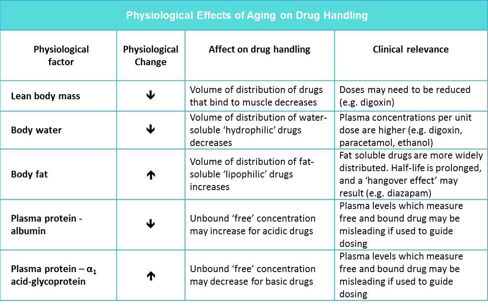

# Prescribing In Older Adults

| Question | Options | Pre-response | Reading | Final |
| --- | --- | --- | ---| --- |
| If no contraindications patients over 65 should recieve the following | Annual flu vax Annual flu and meningococcal C Annual flu and single dose pneumococcal Annual flu, pneumococcal and meningococcal C Annual flu and pneumococcal | Annual flu | | |
| Correct statements about Tricyclics | TCAs *improve* cognitive impairment TCAs reduce intraocular pressure in glaucoma TCAs worsen diarrhoea TCAs reduce QT interval TCAs cause urinary retention | Urinary retention | | |
| Physiological changes affecting drug handling - Correct statement | Reduced total body water, increases volume of distribution of water-soluble drugs like digoxin Increased body fat, decreases volume of distribution of fat soluble drugs like diazepam Steady decline in GFR so renally excreted drugs may accumulate decrease in plasma-albumin concentration decreasing concentration of unbound free drug for therapeutic effect | GFR | GFR | |
| Long term pred. What should be added | Bisphosphonate Fludorcortisone H2-receptor antagonist Metformin PPI | PPI | | |
| 70 yr female on amlodipine 5mg om, diclofenac 50mg tds, sertraline 100mg om and atorvastatin 20mg od, correct statement | For long-term gout NSAID is right option for long-term allopurinol for long term colchicine is first line PPI should be added for GI protection | allopurinol | | |
| 70 yr old gout female gets admited with peptic ulcer, correct statement | PPI whilst on long term NSAID if no alternative treatment NSAID plus atorvastatin increases risk of bleeding Atorvastatin commonly causes GI events Switch to COX-2 selective inhibitor for this patient given GI complications | PPI | | |
| 85 yr female A&E for fall. Falls when getting out of chair. On indapamide 2.5mg om, citalopram 20mg on, docusate 100mg bd, hydroxyzine 25mg on, losartan 25mg om, oxybutynin MR 5mg om, simvastatin 40mg on, aspirin 75mg om, trimethoprim 100mg on, zopiclone 7.5mg on. Which management plan is *not* appropriate | Start betahistine 16mg tds Take sitting and standing BP Change citalopram to morning Change zopiclone to prn Stop or change hydroxyzine to non-sedating | start betahistine | | |
| 75 yr old female low mood and fatigue. On amiodarone 200mg od, atorvastatin 10mg on, aspirin 75mg om, adcal-d3 ii om, alendronate 70mg weekly. Thinking of starting antidepresant - what to recommend | Check TFTs before starting SSRI and review in 6/52 TCA and review in 6/52 Refer to psychologist Stop amiodarone | Check TFTs | | |
| Screening Tool of Older People's potentially inappropriate Prescriptions (STOPP) criteria used in > 65 yr. Which is part of criteria | Stop warfarin for first uncomplicated DVT for longer than 6 months Stop and review LT aspirin doses > 75mg od Stop and review digoxin > 125 micrograms/day with impaired hepatic Stop ACEi following acute MI Stop verapamil in NYHA Class II heart failure | Aspirin | | |
| Medicine *least* likely to affect cognition | Aciclovir Chlorphenamine Codeine Diazepam Promethazine | Aciclovir | | |

70%

## Learning Outcomes

- Describe the processes of absorption, distribution, metabolism and elimination of drugs in the older patient.
- Explain how age-related physiological and pathological processes affect how the body reacts to drugs.
- Explain how physical, cognitive and social aspects may affect an older patient's ability to adhere to treatment.
- Discuss the factors that make older adults more at risk of developing Adverse Drug Reactions (ADRs).
- Develop strategies to reduce problems with medicines in the older adult population.

## Key Points

- Changes in drug disposition occur with age and the main consequence is reduced excretion of water soluble drugs and metabolites.
- Older patients may have altered responsiveness to drugs (e.g. more likely to get postural hypotension with antihypertensive drugs).
- Polypharmacy is a term used to describe the use of multiple medications and/or the administration of more medications than are clinically indicated, representing unnecessary drug use.
- Adherence to treatment regimens can be a problem for older adults. Complex factors (e.g. adverse drug reactions, poor manual dexterity, cognitive impairment, polypharmacy) may mean that older patients do not take their medicines as advised.
- Adverse drug reactions are common and may account for at least 10% of hospital admissions in the older adult population.
- Drug interactions are common and are more likely to occur with polypharmacy and the use of over-the-counter medication.
- The National Service Framework for ‘Older People’ aims to ensure that patients gain maximum benefit from their medicines.  Older people should expect increased or improved quality and duration of life from their medication and should not suffer unnecessarily from illness caused by excessive, inappropriate, or inadequate consumption of medicines [DHSC 2001].

## Pharmacokinetics

Increases in age assocated with:
- Decrease in lean body mass.
- Decrease in body water.
- Increase in body fat in relation to total body weight.
- Decrease in bone mass.

### Absorption

Increased systemic exposure due to reduced liver blood flow.

### Distribution

### Metabolism

