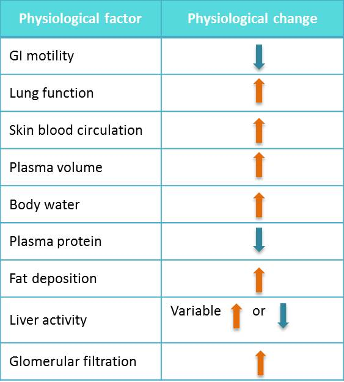

# Prescribing In Older Adults

| Question | Options | Pre-response | Reading | Final |
| --- | --- | --- | ---| --- |
| Neonatal Withdrawal and Respiratory depression occurs with exposure to | Antidepressants Benzodiazepines Beta-blockers Sulphonylureas Tetracyclines | Benzodiazepines | | Benzodiazepines |
| 32/40 165/70 and 3+ protein urea. Pre-eclampsia. Asthma. Which BP medication | Labetalol Nifedipine Hydralazine Propranolol Ramipril | Labetalol | Nifedipine | Nifedipine |
| Hypothyroidism | TSH and T4 levels same as non-pregnant Thyroxine dose to be adjusted early in pregnancy to minimise risk of complications If Thyroxine increased in first/second trimester then to reduce to pre-pregnancy in third TFTs at same intervals as pre-pregnancy Double dose of Thyroxine as soon as pregnancy confirmed | Adjusted early | Adjusted early | Adjusted early|
| Phenytoin 300mg nocte and wanting to start concetraceptive | Combined oral Levonorgestrel intrauterine system Progestegen only oral Progestogen only implant | Levonorgestrel intrauterine system | Levonorgestrel intrauterine system | Levonorgestrel intrauterine system |
| First line in gestational diabetes if diet and exercise don't work within 1-2 weeks | Gliclazide Glibenclamide Liraglutide Metformin | Gliclazide | | Metformin |
| Does not cross placenta | Aspirin Clopidogrel Enoxaparin Ibuprofen Warfarin | Enoxaparin | Enoxaparin (Large Molecule) | Enoxaparin |
| Antiepileptic risk of baby with malformations | 1% 5% 10% 15% 20% | 5% | 10% | 10% |
| Most susceptibe risk of exposure | Embryonic (17 post conception) First Second Third | First | First | First |
| Immunisations in pregnancy | Infuenza vaccine contraindicated MMR booster is recommended Whooping cough recommended Inactivated vaccines are contraindicated Immunisations are contraindicated after 20 weeks gestation | Whooping Cough | | Whooping COught |
| 19yo epilepsy. Phenytoin 300mg nocte and depo-provera, missed. Unsure if wanting to continue with pregnancy. | Folic acid 400 mcg od for 12 weeks Folic acid 400 mcg od for duration of pregnancy Patient on antiepileptic medications should take a higher dose of folic acid and continue for first 12 weeks Folic acid 5mg od for duration of pregnancy No need to prescribe medication | Folic acid 5mg | Higher dose of folic acid for first 12 weeks | Higher dose of folic acid for first 12 weeks |

## Learning Outcomes

- Explain how the physiological changes during pregnancy can alter the pharmacokinetics of a drug, and the need for adjustment of dose regimens as a result.
- Discuss the risks and benefits of prescribing in pregnancy and how this risk changes depending on the trimester.
- Describe how to minimise the risk of harm to the fetus when prescribing in pregnancy.
- Describe the key drugs (or drug groups) that should be avoided during pregnancy and why.
- Describe how to minimise risk of complications in women of child bearing potential.
- Provide examples of drugs where concurrent contraceptive use is essential and why.
- Identify the main sources of information and advice that are available to guide prescribing in pregnant women or women of child bearing potential.

## Session Key Points

- All drugs have the potential to harm the unborn child. Some should be avoided altogether in those who may be pregnant or who are planning a pregnancy.
- Knowledge of the drug and the timing of exposure can help inform whether a drug is appropriate to use in pregnancy.
- The physiological changes that occur during pregnancy may necessitate adjustment of dose and monitoring regimens. 
- Consult reputable sources of information when prescribing during pregnancy. 

## References

[Prescribing in Pregnancy](https://www.gov.uk/guidance/use-of-medicines-in-pregnancy-and-breastfeeding)

[BNF Prescribing in Pregnancy](https://bnf.nice.org.uk/guidance/prescribing-in-pregnancy.html)

[BUMPS - Best Use of Medicines in Pregnancy](https://www.medicinesinpregnancy.org/About-Us/)

[Medicines with teratogenic potential: what is effective contraception and how often is pregnancy testing needed?](https://www.gov.uk/drug-safety-update/medicines-with-teratogenic-potential-what-is-effective-contraception-and-how-often-is-pregnancy-testing-needed)

De Groot,L., Abalovich,M., Alexander EK, Amino,N., et al. (2012) Management of thyroid dysfunction during pregnancy and postpartum: an Endocrine Society clinical practice guideline. Journal of Clinical Endocrinology and Metabolism. 97(8), 2543-2565

[Family Planning Association](www.fpa.org.uk)

[Faculty of Sexual and Reproductive Healthcare.](http://www.fsrh.org/)

[Medicines and Health Care Products Regulatory Agency (MHRA) (2018).Valproate medicines (Epilim▼, Depakote▼): contraindicated in women and girls of childbearing potential unless conditions of Pregnancy Prevention Programme are met. Drug Safety Update.](https://www.gov.uk/drug-safety-update/valproate-medicines-epilim-depakote-contraindicated-in-women-and-girls-of-childbearing-potential-unless-conditions-of-pregnancy-prevention-programme-are-met)

[National Institute for Health and Care Excellence (2015). Diabetes in pregnancy: management of diabetes and its complications from preconception to the postnatal period.](http://www.nice.org.uk/guidance/ng3)

[National Institute for Health and Care Excellence (NICE NG 133) (2019). Hypertension in pregnancy: diagnosis and management. (Online).](https://www.nice.org.uk/guidance/ng133)

[Royal College of Obstetricians and Gynaecologists (2016). The Management of Nausea and Vomiting of Pregnancy and Hyperemesis Gravidarum.](https://www.rcog.org.uk/en/guidelines-research-services/guidelines/gtg69/)

[UK Teratology Information Service.](http://rdtc.nhs.uk/services/teratology)

[Medicines and Health Care Products Regulatory Agency (MHRA) (2021). Antiepileptic drugs in pregnancy: updated advice following comprehensive safety review. Drug Safety Update.](https://www.gov.uk/drug-safety-update/antiepileptic-drugs-in-pregnancy-updated-advice-following-comprehensive-safety-review)

[Medicines and Health Care Products Regulatory Agency (MHRA) (2021). Use of medicines in pregnancy and breastfeeding. Drug Safety Update.](https://www.gov.uk/guidance/use-of-medicines-in-pregnancy-and-breastfeeding)

## Misc Points

pharmacokinetics of medicines can change during pregnancy

## Drug Exposure During Pregnancy

### Teratogenicity

> agent that may cause or contribute to malformation, or abnormal physiological function or affect neurological development of the exposed fetus during pregnancy or following birth

### Known Teratogens

| Agent | Effect |
| --- | --- |
| ACE inhibitors and Angiotensin-II receptor antagonist | lung and kidney hypoplasia, hypocalvaria |
| Antiepileptics | cardiac, facial and limb defects, mental retardation, neural tube defects  |
| Cytotoxic agents | multiple defects, miscarriage  |
| Sex Hormones, progestogens and oestrogens | virilisation of female fetus, feminisation of male fetus  |
| Lithium salts | cardiovascular, congenital goitre, perinatal mortality, prematurity, fetal macrosomia, floppy infant syndrome  |
| Statins | Statins should not be used during pregnancy. Congenital anomalies have been reported and the decreased synthesis of cholesterol possibly affects fetal development. |
| Thalidomide | Limb abnormalities, central facial naevus, cleft palate, cardiovascular, urogenital and gastrointestinal abnormalities and neurodevelopmental  problems |
| Warfarin | nasal hypoplasia, chondrodysplasia punctata |

## Effects on Pharmacokinetics

- In the first trimester more significant respiratory, cardiovascular and renal changes take place than in the third trimester. This may necessitate closer monitoring and dose adjustment.
- The protein binding of phenytoin, diazepam and sodium valproate has been shown to decrease during the last trimester of pregnancy.
- The volume of distribution can change during pregnancy. This may be clinically significant for drugs with a narrow therapeutic range such as phenytoin, carbamazepine and digoxin.
- Monitoring the drug concentration, where possible, can help you titrate the dose.

### Considerations

1. Is she already pregnant?
2. Is she trying to become pregnant?
3. Is she at risk of an unplanned pregnancy?
4. Is she actively avoiding conception through contraception?*

### If already pregnant

- Consider if drug therapy is necessary.  For example, avoid systemic antibacterials for acne.
- If possible, avoid medicines in the first trimester when the risk of harm to the fetus is greatest.
- Avoid medicines that are known to be harmful (check information sources).
- Avoid new medicines on the market due to lack of safety data.
- Avoid polypharmacy, as the risk of harm is increased.
- Consider the need to adjust dosage, based upon the changes in maternal physiology and pharmacokinetics.  This is especially important for drugs with a narrow therapeutic range.
- Involve the patient in all therapeutic decisions.
- Advise patients not to self-medicate with over-the-counter medicines and alternative therapies without consulting a healthcare professional first.
- Remember, patient information leaflets have medico-legal statements about the use of medicine in pregnancy.

### Inducers and contraception

- Enzyme-inducing drugs such as carbamazepine may reduce the concentration of both oestrogens and progestogens and impair contraceptive effectiveness.  
- Women on enzyme-inducing drugs should be informed that oral hormonal contraceptives (e.g. combined-oral pill, progestogen only pill) and the progestogen-only implant contraception methods may be ineffective.
- Women should be offered a method unaffected by enzyme-inducing drugs, such as intrauterine contraceptive devices (i.e. copper intrauterine device, levonorgestrel-releasing intrauterine system) or injectable contraception (i.e. depomedroxyprogesterone acetate injection).
- If a woman wishes to continue an oral contraceptive explain the risks and that current guidelines recommend using an alternative contraceptive method as outlined above. In some scenarios, you might consider prescribing a preparation containing at least 50 micrograms of ethinylestradiol, taken either continuously or as a "tri-cycling" regimen.

- Women seeking emergency contraception who have used cytochrome P450 3A4 (CYP3A4) enzyme inducers such as carbamazepine within the last 4 weeks, should preferably use a non-hormonal emergency contraceptive (i.e. a copper intrauterine device).
- However, if this is not an option, double the usual dose of levonorgestrel from 1.5 milligrams to 3 mg (2 packs).

## Analgesia

| Agent | Details |
| --- | --- |
| Paracetamol |Short courses and occasional use of paracetamol is generally considered safe during pregnancy. There have been reports that it may be associated with a greater risk of conduct problems and hyperactivity symptoms in the child. However, the studies have not yet provided sufficient evidence to inform or change guidelines. There is also debate that other factors such as environment, health and socioeconomic status have not been considered.  As it stands, paracetamol is safe as long as it is prescribed within the dose recommendations and only prescribed for occasional use. |
| NSAIDs | NSAIDs should be avoided during pregnancy, particularly in the third trimester since use has been associated with premature closure of the fetal ductus arteriosus. |
| Opioids | There is limited information relating to the safety of dihydrocodeine during pregnancy. However it is known that prolonged use of any opioid analgesic during pregnancy can cause neonatal withdrawal syndrome and when taken shortly before delivery it can increase the risk of neonatal respiratory depression. |

## Antiepileptics

- Have approximately a 2-3 fold increased risk of malformations, i.e. up to a 10% risk of the baby having abnormalities (there is at least a 90% chance of having a normal baby).
- The most commonly observed major malformations are heart defects, orofacial clefting, genitourinary malformations and neural tube defects (1%); the incidence of these conditions is dose related.

- Lamotrigine and levetiracetam are the safer of the medicines reviewed to use during pregnancy.
- Lamotrigine and levetiracetam are not associated with an increased risk of major congenital malformations in the study data reviewed.
- The data set for neurodevelopmental outcomes is smaller but also suggests there is no increased risk of neurodevelopment disorders or delay with lamotrigine and levetiracetam. However, more data is needed to confirm this finding.
- There is an increased risk of major congenital malformations associated with carbamazepine, phenytoin, phenobarbital and topiramate use during pregnancy.
- There is the possibility of neurodevelopment adverse effects in children borne to mothers who took phenobarbital and phenytoin during pregnancy. 
- Folic acid 5 mg daily should be taken daily throughout the first trimester (12 weeks) of pregnancy to reduce the risk of neural tube defects. Where possible, women taking antiepilpetic medicines who are planning to conceive should begin taking folic acid 5 mg daily prior to conception.

## Diabetes

- Gliclazide: Before, or as soon as pregnancy is confirmed, oral hypoglycaemic agents (apart from metformin) should be stopped and insulin started if required. Rapid-acting insulin analogues (aspart and lispro) do not adversely affect pregnancy or the health of the fetus or newborn baby.  Isophane insulin (NPH) is the first-choice longer-acting insulin.
- Metformin: Although metformin may be used before and during pregnancy, as well as or instead of insulin, the likely benefits from improved glycaemic control should be considered carefully against the potential for harm.

## Hypertension

- Target BP 135/85 mmHg
- Labetalol, a non-selective beta-adrenoceptor antagonist, is recommended first-line for management of gestational hypertension. Once pharmacological treatment is initiated, you should aim for a target blood pressure of 135/85 mmHg or less.
- Consider nifedipine if labetalol is unsuitable. Methyldopa can be considered if labetalol or nifedipine are both unsuitable but stopped within 2 days of birth.

## Thyroid Dysfunction

Euthyroidism should be achieved prior to conception. Even mild hypothyroidism is associated with increased risk of miscarriage, preterm labour and neurodevelopment delay in the unborn child. Thyroid Stimulating Hormone (TSH) concentrations should be kept below 2.5 milliunits/litre prior to conception.

Thyroxine requirements increase by approximately 30 - 50% from very early in pregnancy, as a result of the following physiological changes:
- Increased renal iodide clearance.
- Increased thyroxine binding globulin production.
- TSH receptor stimulation by human chorionic gonadotrophin.
- Increased thyroid hormone metabolism by placental deiodinase enzymes.
- Increased maternal plasma volume and maternal thyroid hormone transfer to the developing fetus.

- Check (Thyroid Function Tests) TFTs as soon as the pregnancy is confirmed.
- Ensure trimester specific references ranges are used for both TSH and free T4; these differ from non-pregnant ranges and can vary between laboratories.  
- Discuss the TFTs and the patient's current dosing schedule with an endocrinologist to determine if any changes are required in the dose of levothyroxine and the frequency of monitoring.
- Perform TFTs regularly, especially in the first 20 weeks of pregnancy.
- Following delivery, discuss any changes and the frequency of monitoring with an endocrinologist.
- Remember that thyroxine requirements may remain elevated during breastfeeding.