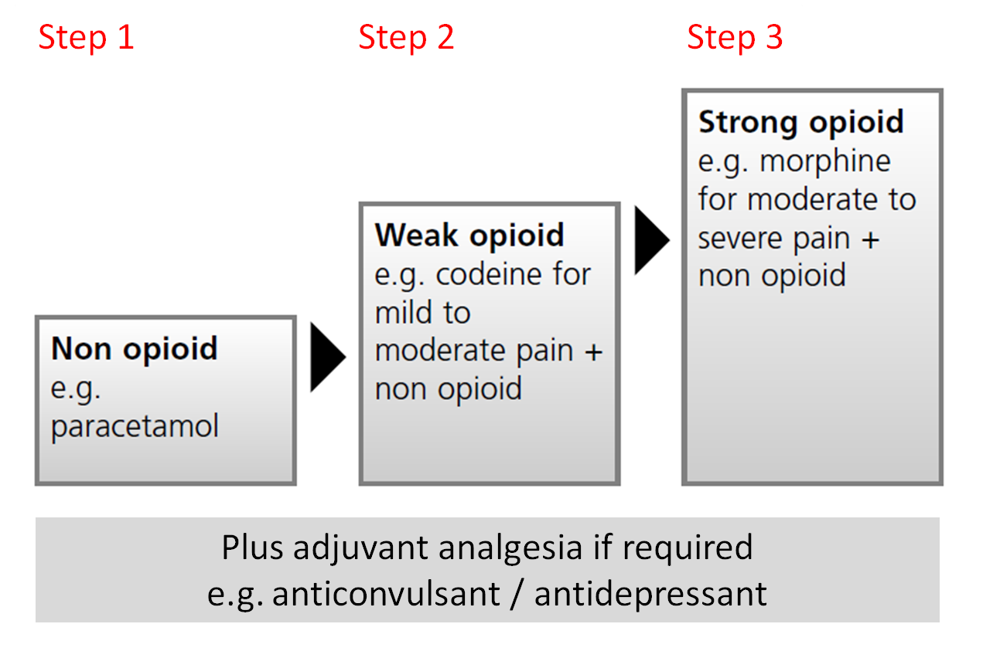

# Management of Pain

90%

| Question | Options | Pre-response | Reading | Final |
| --- | --- | --- | --- | --- |
| 30 yr male motorbike | Neuropathic Nociceptive Phantom Psychological | Neuropathic | | Neuropathic |
| Correct Statements | Paracetamol prescribed and administered at same time as ibuprofen Paracetamol > 4g in 24 hrs in overweight patients Paracetamol for 60kg as 40 kg Paracetamol is adjunction Co-codamol and paracetamol | Paracetamol and Ibuprofen | | Paracetamol and Ibuprofen |
| Serious local anaesthetic poisoning caused by inadvertent IV administration | IV acetylcysteine IV calcium gluconate IV flumazenil IV intralipid IV naloxone | IV Flumazenil | Intralipid | Intralipid |
| Correct statement | SSRI and long term NSAID should get PPI Warfarin and NSAID should get PPI COX-2 NSAIDs can be prescribed in Asthma as long as they don't exacerbate as COX-1 NSAIDs NSAID analgesic in severe liver disease Low dose aspirin and NSAID can be safely co-prescribed | SSRI | SSRI | SSRI |
| 12 yr girl 39kg IV paracetamol | 500mg | 500mg | | 500 mg |
| COX-1 NSAIDS have ____ (i) risk of GI vs COX-2 NSAIDs COX-2 NSAIDs have been associated with an increased risk of causing ____ (ii) with long-term use | Lower; Thrombotic Higher; Thrombotic Lower; Oesophageal Higher; Oesophageal | Higher;Thrombotic | Higher; Thrombotic| Higher; Thrombotic |
| 50 yr man fibromyalgia. Tramadol 100mg qds Codeine 16mg qds | Tramadol 100mg qds and oramorph 5mg prn Tramadol 100mg qds MST 10mg bd MST 10mg bd MST 20mg bd, 5mg oramorph prn MST 40mg bd, 10mg oramorph prn | MST 40mg bd | | MST 20mg bd |
|40 yr male. 40 mg/24hrs oramorph three days | MST 20mg bd MST 20mg bd 5mg oramorph prn Morphine immediate release 20mg bd oramorph 5mg prn MST 20mg bd 15mg oramorph prn MST 40mg bd 10mg oramorph prn | MST 20mg bd oramorph 5mg prn | | MST 20mg bd oramorph 5mg prn |
| Lidocaine 3mg/kg 55kg IV regional anaesthesia. Lidocaine 1%. How many mls | 165mg 1g in 100ml 10mg/ml | | 16.5 ml |
| Least likely neuropathic | Amitriptyline Duloxetine Gabapentin Pregabalin Venlafaxine | Venlafaxine | Venlafaxine | Venlafaxine |

## Learning Objectives

- Describe how the WHO Pain ladder assists in rational prescribing of analgesic therapy for both acute and chronic pain.
- Explain the risks associated with paracetamol and Non-Steroidal Anti-Inflammatory Drugs (NSAIDs), and how these may be minimised.
- List the weak opioid analgesics available for prescribing in the UK, and when they are appropriate for use.
- Identify strong opioid analgesics, and how to minimise the risks when switching between different opioid analgesics and titrating doses to meet individual patient requirements.
- Describe the indications and cautions of Patient Controlled Analgesia (PCA).
- Recall the stepwise management of neuropathic pain, and understand when a referral to the specialist Pain team is necessary.
- Describe the use of local anaesthetics in secondary care setting, and how to recognise and manage toxicity.  
- Identify patients with complex analgesic requirements where input may be required from specialist teams.

## Key Points

- The WHO ladder plays an important role for all pharmaco-therapeutic options for pain control.
- Responsiveness to analgesics varies between patients.
- There is a misplaced familiarity with the prescribing and administration of paracetamol. A familiarity thought to derive from its common use. 
- Serious and life-threatening gastrointestinal (GI) toxicity remains a major problem with NSAIDs.
- Assess patients requiring NSAIDs for cardiovascular and GI risk factors.
- In opioid naïve patients where there is no tolerance to morphine, patients may be at increased risk of respiratory depression.
- Individualisation of the scheduled opioid dose through a process of dose titration is critical to a successful outcome. 
- For breakthrough pain in patients who are taking modified-release opioids, the ‘as required’ dose has traditionally been equivalent to one tenth to one sixth of the total daily background strong opioid dose.

## Resources

[Leaflet for Addiction Warning with Opioids](https://www.gov.uk/guidance/opioid-medicines-and-the-risk-of-addiction)
- Derry S and Loke Y. Risk of gastrointestinal haemorrhage with long-term use of aspirin: meta-analysis. BMJ (2000); 321:1183-1187.
- Dickenson A.H. Gate Control Theory of Pain stands the test of time. British Journal of Anaesthesia.(2002); 88:755-757
- National Institute for Health and Care Excellence (2004). Gastro-oesophageal reflux disease and dyspepsia in adults: investigation and management.  Available online at http://www.nice.org.uk/guidance/cg184
- Royal College of Anaesthetists, Royal College of Nursing, The Association of Anaesthetists of Great Britain and Ireland, Best practice in the management of continuous epidural analgesia in the hospital setting. The European Society. Available online at http://www.rcoa.ac.uk/document-store/best-practice-the-management-of-epidural-analgesia-the-hospital-setting
- National Patient Safety Agency (2009). Introduction of safer spinal and epidural devices will reduce risk of wrong route errors. Available online at www.npsa.nhs.uk/corporate/news/introduction-of-safer-spinal-and-epidural-devices-will-reduce-risk-of-wrong-route-errors-england/
- National Institute for Health and Care Excellence (2016) (NG 59). Low back pain and sciatica in over 16s: assessment and management. (Online). Available at https://www.nice.org.uk/guidance/NG59
- Haffey F et al. A comparison of the reliability of smartphone apps for opioid conversion. Drug Safety (2013);36(2):111-117
- Neuropathic Pain. Clinical Knowledge Summaries (CKS). Available online at http://cks.nice.org.uk/neuropathic-pain-drug-treatment
- National Institute for Health and Care Excellence (2013). Neuropathic pain - Pharmacological Management. Available online at http://guidance.nice.org.uk/CG173
- National Institute for Health and Care Excellence (2012). Opioids in palliative care. Clinical guidelines on the safe and effective prescribing of strong opioids in palliative care for adults. Available online at http://www.nice.org.uk/cg140
- Paton C, Ferrier N.I. SSRIs and gastrointestinal bleeding. BMJ (2005);331:529. Available online at www.bmj.com
- Rodriguez G L. and Jick H. Risk of upper gastrointestinal bleeding and perforation associated with individual non-steroidal anti-inflammatory drugs. Lancet (1994); 343:769-772.
- The third national audit project of the Royal College of Anaesthetists. Major complications of central neuroaxial block in the United Kingdom. Report and Findings (2009). Available online at http://www.rcoa.ac.uk/nap3

## Definition of Pain

> “An unpleasant sensory and emotional experience associated with, or resembling that associated with, actual or potential tissue damage”.

## Classifications

| Type | Details |
| --- | --- |
| Acute | usually short-lived and resolves when the painful stimulus is removed (e.g. spraining an ankle, stubbing a toe). It provides the body with a warning that often helps to prevent further damage. The pain usually diminishes as healing progresses. |
| Chronic | pain persists despite the trauma or injury healing and is often present for more than 3 months. |
| Nociceptive | As a response to a pathophysiologic process occurring within the tissues (e.g. inflammation). The pain signal originates from intact primary afferent nerves that signal noxious events, or nociceptors. Nociceptors can be sensitised by release of algogenic agents (e.g. prostaglandins, bradykinin, serotonin, adenosine, and cytokines). |
| Neuropathic | In response to a pathologic process occurring along and within the nervous system pain pathways. The pain signal is generated ectopically and often in the absence of ongoing noxious events by pathologic processes in the peripheral or central nervous system. |

## Assessing Pain

| Factor | Details |
| --- | --- |
| Site | where is the pain? |
| Onset | when did the pain start, and was it sudden or gradual? |
| Character | what is the pain like? (aching, shooting, tingling) |
| Radiation | does the pain radiate anywhere? |
| Associations | any other signs or symptoms associated with the pain? |
| Time course | does the pain follow any pattern? |
| Exacerbating/relieving factors | does anything change the pain? |
| Severity | how bad is the pain? |

## WHO pain ladder

| Agent Type | Details |
| --- | --- |
| Non-opioid drugs | include paracetamol and the Non-Steroidal Anti-Inflammatory Drugs (NSAIDs). |
| Opioids | (include the pure mu (µ)-agonists and the agonist-antagonist drugs). |
| Adjuvant analgesics | are defined as medicines that are intended for indications other than pain, but can also be used as analgesics in select circumstances. There are a large number of these drugs in diverse therapeutic classes. It is important you recognise that these are used in ‘combination’ to provide a multimodal approach to pain pharmacotherapy to match the multiple sources of pain and its perception in our neurobiology. |

## WHO pain ladder step 1

### Paracetamol

- Paracetamol is an effective analgesic that has antipyretic activity with no perceived peripheral anti-inflammatory properties.
- Despite being one of the most commonly used analgesics, its true mechanism of action is still widely debated. 
- Paracetamol can be administered orally, rectally and intravenously.  
- It is available over-the-counter in various oral forms (tablets, capsules, soluble tablets and liquid) both alone and in combined preparations (e.g. in cold and flu remedies) for pain and pyrexia.  
- It is well absorbed orally, reaching peak concentrations in 30‒60 minutes depending on the formulation used. 
- Paracetamol can be effective when prescribed along-side opioid analgesia. If given regularly, it can reduce opioid requirements by 20‒30%.
- The use of oral paracetamol in adults in combination with Patient Controlled Analgesia (PCA) can reduce overall pain scores, shorten duration of PCA use and improve patient satisfaction.

### NSAIDs

- NSAIDs are classified as COX-1 or COX-2 inhibitors based on their potential for inhibiting either of these isoenzymes. However in reality the extent of inhibition of COX-1 or COX-2 tends to be a relative rather than an absolute value.
- NSAIDs which inhibit COX-1, a 'constitutive' enzyme, expressed in most tissues are thought to produce more gastrointestinal (GI) toxicity.
- NSAIDs which have selectivity for COX-2, which is induced in inflammatory cells when 'activated', exhibit less GI toxicity.
- COX-2 selective NSAIDS were developed in an attempt to reduce the high level of GI toxicity observed. However the picture seems to be more complicated with GI toxicity being multi-factorial. COX-2 selective NSAIDs have still been associated with serious and fatal GI adverse reactions, although generally the risk of GI adverse events seems lower with short-term use. Examples of COX-2 selective NSAIDs include celecoxib and etoricoxib.

#### Toxicity

| GI-related toxicity risk | NSAIDS |
| --- | --- |
| Lower | Ibuprofen and etoricoxib |
| Average | Diclofenac, indometacin and naproxen |
| Higher | Aspirin and ketorolac |

#### Considerations

- Assess patients requiring NSAIDs for cardiovascular and GI risk factors. Select an NSAID based on patient risk factors and local formulary recommendations.
- Use the lowest effective dose for the shortest period of time to achieve symptom control. 
- Consider prescribing a Proton Pump Inhibitor (PPI) for any patient who you assess to be at high risk of GI adverse effects (i.e. older adults, past history of peptic ulcer disease or GI complaints).
- Prescribe a PPI in patients on concomitant medicines that also increase the risk of GI ulceration or bleeding (e.g selective serotonin re-uptake inhibitors, corticosteroids).
  - Serotonin is released from platelets in response to vascular injury and promotes vasoconstriction and a change in the shape of the platelets that leads to aggregation. SSRIs inhibit the serotonin transporter, which is responsible for the uptake of serotonin into platelets. It could thus be predicted that SSRIs would deplete platelet serotonin, leading to a reduced ability to form clots and a subsequent increase in the risk of bleeding
- Avoid concomitant administration of an NSAID with warfarin (or other oral anticoagulants); this increases the risk of bleeding more than tenfold.
- NSAIDs can worsen the symptoms of asthma in some patients.
- NSAIDs are contraindicated in severe liver disease as they can worsen liver function. They can increase the risk of bleeding and cause fluid retention. In severe liver disease, renal blood flow is reliant to some extent on prostacyclins, therefore the administration of NSAIDs reduces the amount of prostacyclins in the kidney, reducing renal blood flow and leading to deterioration in renal function.
- NSAID can worsen renal function in those patients where renal function is already compromised. Avoid NSAIDs (or use with caution) in such patients (e.g. older adults and patients with cardiovascular disease). Prescribe the lowest effective dose for the shortest period of time and monitor renal function at baseline and throughout treatment.

## WHO pain ladder step 2 : Weak Opioids

### Codeine

- Codeine is a pro-drug, which is metabolised by the cytochrome P450 enzyme CYP2D6 to its active form, morphine. Some patients are slow or fast metabolisers via this enzyme. This accounts for patients getting a different analgesic response from the same dose of codeine.
- The MHRA has advised that codeine should no longer be routinely used as an analgesic in children under 12-years because of the risk of overdose in fast metabolisers. It should also not be used in children under 18 years for procedures including tonsillectomy, adenoidectomy or sleep apnoea.
- Codeine is usually administered orally or intramuscularly. Codeine should not be administered intravenously due to the risk of anaphylactic reaction.

### Tramadol

| Advantages | Disadvantages |
| --- | --- |
| Useful where NSAIDs are contraindicated. Can be useful in chronic pain. May be useful in neuropathic pain. Cause less respiratory depression. May be less constipating. | Can cause severe nausea and vomiting. Has no analgesic effect in some patients. Must be used with caution in patients with epilepsy. Is non-formulary in some NHS Trusts. |

### Combined Preparations

- The effervescent formulations can provide significant amounts of sodium if taken on a regular basis - be aware of this when prescribing in patients on sodium restricted diets.
- Inform your patients of the adverse effects of opioids - even low dose combinations can cause significant constipation.
- Combined preparations may reduce the tablet burden for some patients with chronic pain.
- Be aware that combined preparations do not allow for dose titration, and for acute pain it may be more appropriate to prescribe the constituents separately.
- Remember to remind patients that the preparations contain paracetamol and clarify the patient's understanding of the maximum daily dose of paracetamol (4 grams in 24 hours in the average adult). Consumption of paracetamol alongside a combined preparation is a major cause of accidental overdose.

## WHO pain ladder step : Strong Opioids

### Strong Opioids

#### Agents

- Morphine
- Buprenorphine
- Diamorphine
- Fentanyl
- Hydromorphone
- Oxycodone
- Methadone

If a patient requires converting from one opioid to another because of:

- Adverse effects,
- Reduced clearance of the drug leading to toxicity or
- Due to lack of response after careful dose titration. 

#### Dosing

> Individualisation of the scheduled opioid dose through a process of dose titration is critical to a successful outcome. 

#### Adverse Effects

Naloxone

- In opioid naïve patients where there is no tolerance to morphine, patients may be at risk of respiratory depression.
- Care should be taken to prescribe an appropriate dose taking age, renal and liver function into account.
- Patients taking morphine for chronic pain (e.g. cancer related) and having their morphine doses titrated to pain are unlikely to get respiratory depression unless a large stepwise increase in dosage is administered.

Antiemetics

Patients taking opioids acutely for postoperative pain should be prescribed antiemetics; however patients who have been taking opioids for some time for chronic pain usually become tolerant to the emetic adverse effects of opioids within a few days.

Immunosuppression

- There is evidence that the immune system is depressed by long-term use of opiates. Although many advances have been made in understanding the effects of opioid drugs on immune responses, their relevance is not completely clear.
- This impact of the opioid-mediated immune effects could be particularly dangerous in selective vulnerable populations, such as older adults or immunocompromised patients. [Sacerdote P. 2008].

Constipation

- All opioids cause constipation and it is not related to the dose of opioid. Patients should be offered advice and prescribed laxatives where appropriate.
- Laxatives should always be titrated to the patient’s normal bowel habit.

#### Dependence Risk

- Discuss with patients that prolonged use may lead to dependence and addiction even at prescribed doses
- Develop a treatment plan (including when treatment will end) prior to initiating opioids
- Explain to the patient the risks of tolerance and potentially fatal unintentional overdose
- Provide regular monitoring 
- Taper dosage slowing when stopping treatment to reduce the risk of withdrawal

## Adjuvant Analgesics

> Drugs with other indications that may be analgesic in specific circumstances

> an agent that is not classed primarily as an analgesic, but is one which has pharmacological activity to alter pain transmission or perception where traditional analgesic drugs have not been effective. It is not uncommon in pain management and palliative care to use drugs beyond their licensed indications (i.e. used unlicensed or  'off-label') if  there is evidence to support their use.

| Agent | Details |
| --- | --- |
| Antidepressants | Tri-cyclic antidepressants (e.g. amitriptyline licensed for neuropathic pain). The doses used are approximately one tenth of the antidepressant dose. Serotonin-noradrenaline re-uptake inhibitors (e.g. duloxetine licensed for diabetic neuropathy). |
| Anticonvulsants | Carbamazepine (licensed for the treatment of trigeminal neuralgia. Used ‘off-label’ for diabetic neuropathy) Gabapentin (licensed for neuropathic pain) Lamotrigine Pregabalin (licensed for neuropathic pain). |
| NMDA-receptor antagonists | Amantadine Ketamine Magnesium Methadone |
| Miscellaneous | Alpha-2- agonists Calcitonin and bisphosphonates Cannabis sativa extracts (Sativex®) Glucocorticoids Inhalational nitrous oxide Local anaesthetics as membrane stabilisers |

## Breakthrough Pain

> “Any transitory increase in pain which occurs in a patient where pain is generally otherwise controlled usually with a modified-release analgesic preparation”. 

- The most common approach to long-term therapy involves co-administration of a long-acting and short-acting analgesic, the latter offered ‘as required’ for breakthrough pain to cover these episodes.
- Predictable episodes can be easier to manage with knowledge of the duration of action of the analgesia. For example, an immediate-release preparation can be administered to ensure peak plasma concentrations at times when painful interventions are expected. The BNF recommends this breakthrough dose is one tenth to one sixth of the total daily background strong opioid dose [BNF].

## Neuropathic Pain

> can be caused by spontaneous discharge in the Peripheral Nervous System (PNS) pathways. It may also originate in the Dorsal-Root-Ganglion (DRG) cells of the damaged afferent axons. 

> describe neuropathic pain as ‘shooting’, ‘stabbing’, ‘burning’, ‘tingling’ or ‘itching’. Stimuli that are not usually painful such as light touch may provoke pain (allodynia) or pain may be exaggerated (hyperalgesia). It has been suggested that poorly managed postoperative pain is a risk factor in the development of neuropathic pain. Neuropathic pain may respond poorly to standard analgesic therapy.

| Treatment | Details |
| --- | --- |
| Treating the underlying cause | Treatment of the underlying cause may help manage pain. For example, if a patient has diabetic neuropathy, then good diabetes control may help to ease the associated pain. |
| Pharmacological Therapy | Neuropathic pain may respond poorly to standard analgesic therapy. At present, treatment guidelines do not recommend a single gold standard treatment for the management of neuropathic pain. Recommendations are for an antidepressant or antiepileptic drug as first-line non-specialist treatment, either alone or in combination together with non-pharmacological management such as surgical treatment and psychological interventions. |

### Drug Treatments

| Agent | Details |
| --- | --- |
| Amitriptyline | (licensed indication) dosing should start at 10 mg at night, gradually increasing if necessary to 75 mg daily in the non-specialist setting. |
| Duloxetine | Cymbalta® brand is licensed for diabetic neuropathy. Dosing should start at 60 mg daily (maximum 120 mg daily in divided doses). |
| Gabapentin | is licensed for peripheral neuropathic pain. Dosing is titrated upwards on a daily basis, starting as described in the BNF or according to local guidelines. |
| Pregabalin | is licensed for peripheral and central neuropathic pain. Dosing should start at 150 mg daily in 2–3 divided doses with gradual dose titration to a maximum of 600 mg per day in divided doses. |

## Local Anaesthetics

| Use | Details |
| --- | --- |
| Epidural blocks | often as an infusion during surgical procedures and after for postoperative pain relief. |
| Peripheral nerve blocks | either as a single injection or as an ongoing indwelling infusion. |
| Surface anaesthesia (topically on skin) | such as EMLA® cream and lidocaine patches or lidocaine gel to mucous membranes. |
