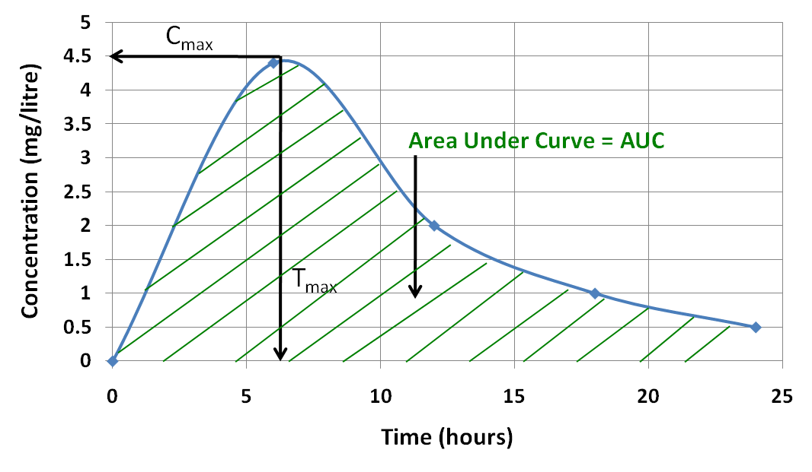
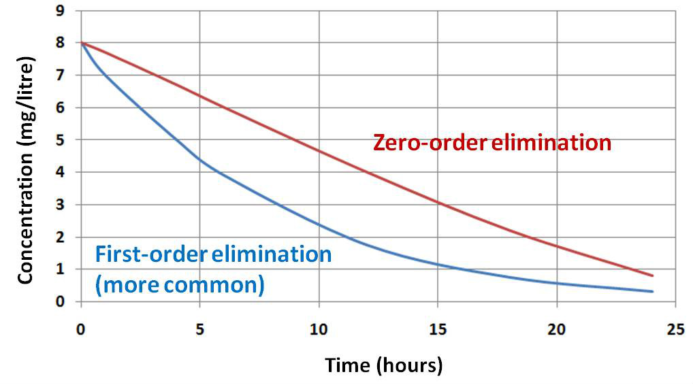
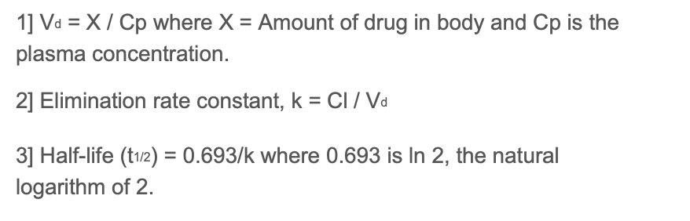

# Dosing and Kinetcs

## Stuff to find out

- Volume of distribution
- First Order Kinetics

## Session Key Points

- Clinical kinetics describes the processes a drug will go through to produce its clinical effect, from the moment it is administered until it is removed from the body
- Factors affecting Absorption, Distribution, Metabolism and Elimination govern the rate and extent of a drug's action
- Bioavailability is the extent to which a drug reaches the systemic circulation, where it is available to act at the 'effector site'
- The pharmacokinetic characteristics of a drug in the body can be defined by three parameters: the volume of distribution (Vd), half-life (t1/2) and clearance (Cl)
- Elimination half-life (t1/2) is a measure of the time taken for the plasma concentration of a drug to fall by half. The concentration falls to a quarter in two half-lives, and 1/32 (3.125%) in five half-lives - so over 95% has gone after five half-lives
- Monitoring of drug concentration can be important for drugs that have a narrow therapeutic index

## Routes of Administration

| Route | Used when |
| --- | --- |
| Parenteral | Your patient is unable to take drugs orally (vomiting) A rapid onset of action is required (anaesthetic induction) The drug is not available as an oral formulation (adrenaline, insulin) |
| Topical | Skin conditions (e.g. antifungal or corticosteroid cream) Local anaesthetic (e.g. lidocaine with prilocaine as EMLA® cream) For systemic absorption of drugs to act as a 'slow-release preparation' (e.g. nicotine patch for smoking cessation) |

## Bioavailability

> Bioavailability is the extent to which a drug reaches the systemic circulation where it is available to act at the 'effector site' (e.g. the brain for a sedative effect). When a drug is administered intravenously, it has a bioavailability of 100%.

| Factors | Impact |
| --- | --- |
| Route of administration | a drug given orally has to be absorbed in the gut before reaching the systemic circulation (e.g. carbamazepine) |
| Properties of the drug | a highly lipid-soluble drug will be absorbed better (e.g. glyceryl trinitrate) |
| Plasma-protein binding | highly protein bound drugs have less free drug to act at the receptor site (e.g. propranolol) (distribution) |
| Metabolism | drugs absorbed by the gut pass through the liver via the portal circulation where they are metabolised (e.g. benzodiazepines) |
| Elimination | a drug eliminated through the kidneys will accumulate in renal dysfunction (e.g. digoxin) |

### Parameters

| Parameter | Explanation |
| --- | --- |
| Area Under the Curve (AUC) | Total dose of drug made bioavailable |
| Peak plasma concentration (Cmax) | Highest concentration acheived after administration |
| Time to peak plasma concentration (Tmax) | The time taken to reach peak plasma concentration |
| Steady State Concentration | When the inflow of the drug into plasma is equal to the rate of removal |
| Half Life | The time for the plasma concentration to fall by half For most drugs, the fall is related to elimination from the body and so it is called the 'elimination half-life' |
| Clearance | approximately five half-lives for 97% of the drug to be eliminated from the body |

### Patient factors affecting bioavailability

| Factor | Effect |
| --- | --- |
| GI transit time | Governs the time taken to traverse the GI system, in particular the small-intestine, which is the primary location for drug absorption Postoperative ileus is common and influences enteral drug administration |
| GI pH | The pH affects the ionisation state of drugs pH 1 (strongly acidic) in the stomach to pH 8 (alkaline) in the small intestine Unionised drugs are absorbed better, therefore: Acidic drugs (e.g. aspirin) are better absorbed in the stomach Basic drugs (e.g. metoclopramide) are better absorbed in the small intestine Relevant in treating patients who have had GI surgery (e.g. gastric bypass surgery or small bowel resection) |
| Concomitant drug administration | Erythromycin inhibits warfarin metabolism Phenytoin increases metabolism of other antiepileptics Rifampicin increases the metabolism of oestrogen in the oral contraceptive pill  |

### Formulation factors

| Factor | Effect |
| --- | --- |
| Tablets | Formulation coatings enteric coatings (EC) are designed to protect the drug from degradation along the GI tract (e.g. through pH changes)  MR coatings utilise these changes to control the rate of delivery and absorption of drug into the systemic circulation |
| Use of Pro-drugs | Codeine converted to Morphine Azathioprine to Mercaptopurine Enalapril to Enalaprilat |

## Pharmacokinetics

### Definitions

| Term | Definition | High value indicates... |
| --- | --- | --- |
| Volume of Distribution | Theoretical volume of fluid that would be needed to achieve the actual plasma drug concentration Drug molecules distribute outside the vascular compartment this explains why Vd is often much higher than a person's actual blood volume  Vd = Total amount of drug in the body (X)➗Plasma-drug concentration (Cp)| Drugs with a high Vd will have a low plasma concentration Lipid Soluble Distributed in Tissues |

#### Volume of Distribution

| Patient Type | Proportions | Impact on Volume of Distribution |
| --- | --- | --- |
| Children | Higher percentage of total body water than adults Reduces as they get older | Water soluble drugs in children will have a higher Vd. Therefore, drugs that are highly water soluble may require higher doses on a milligram per kilogram basis of body weight to achieve similar plasma concentrations. Lipid soluble drugs in children will have a lower Vd |
| Pregnancy and oedema | Increase in total body water | Water soluble drugs will have a higher Vd leading to lower plasma concentrations Therefore, higher doses may be needed for a given therapeutic effect.|
| Older adults and dehydrated patients | Lower percentage of total body water compared with a 'healthy' adult As adults age there is generally an increase in body fat and a decrease in total body water | Water soluble drugs will have a lower Vd Lipid soluble drugs will have a higher Vd. This can lead to an increase in the elimination half-life and a prolonged effect Therefore, a reduced dose may be required. |

#### Compartments

| Compartment | Area |
| --- | --- |
| Central | Vascular Lungs Kidney Muscle |
| Peripheral | Fat |

- When a drug enters the blood, it starts distributing into all perfused areas.
- Since fat is less vascular, a smaller proportion of drug enters this peripheral compartment.
- However, if you continue to give a drug over a period of time, there is time to diffuse into fat, which takes up a larger quantity of the drug due to its larger mass.
- Then when you stop giving the drug, the concentration gradient is reversed and the drug starts going into the blood from the fat, thereby maintaining serum concentrations.
- The fat acts as a reservoir of drug with 'slow release'.
- The implications of this are greater for fat soluble drugs, which tend to have long half-lives.

#### Protein Binding

Highly protein bound drugs have low volumes of distribution

Only unbound (or free) drugs can cross biological membranes and elicit a clinical response.

Measure fraction bound and fraction unbound

### Elimination Half life

Elimination half-life (t1/2) is a measure of the time taken for the plasma concentration of a drug to fall by 50%

Most of the drug, approximately 97% is eliminated after five half-lives

| Order of Kinetics | Impact | Reason |
| --- | --- | --- |
| Zero | Linear | Enzymatic processes get saturated |
| First | Exponential | |

### Clearance

> The clearance of a drug is the hypothetical volume of blood from which the drug is completely removed per unit time It is expressed as units of volume per unit of time (e.g. litre/hour or ml/minute).

### Equations

## Heptatic Metabolism

| Factor | Effect |
| --- | --- |
| Liver function | presence of cytochrome P450 enzyme Inducers and Inhibitors |
| Hepatic blood flow | can be decreased in shock and gastrointestinal surgery, affecting the amount of drug presented to the liver |

## Renal Metabolism

Excrete water soluble metabolites (produced by Liver) but also "unchanged" drugs. Impairment can cause accumulation.

## Therapeutic Drug Monitoring

Therapeutic Index/Window - effective therapeutic dose for clinical treatment and there is no risk of drug-associated toxicity.
Narrow Therapeutic Index Drugs require TDM