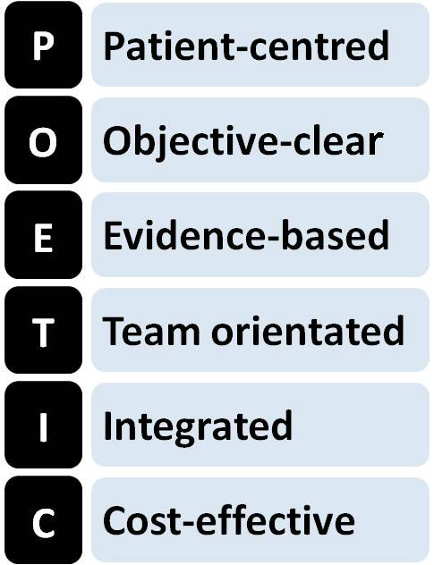
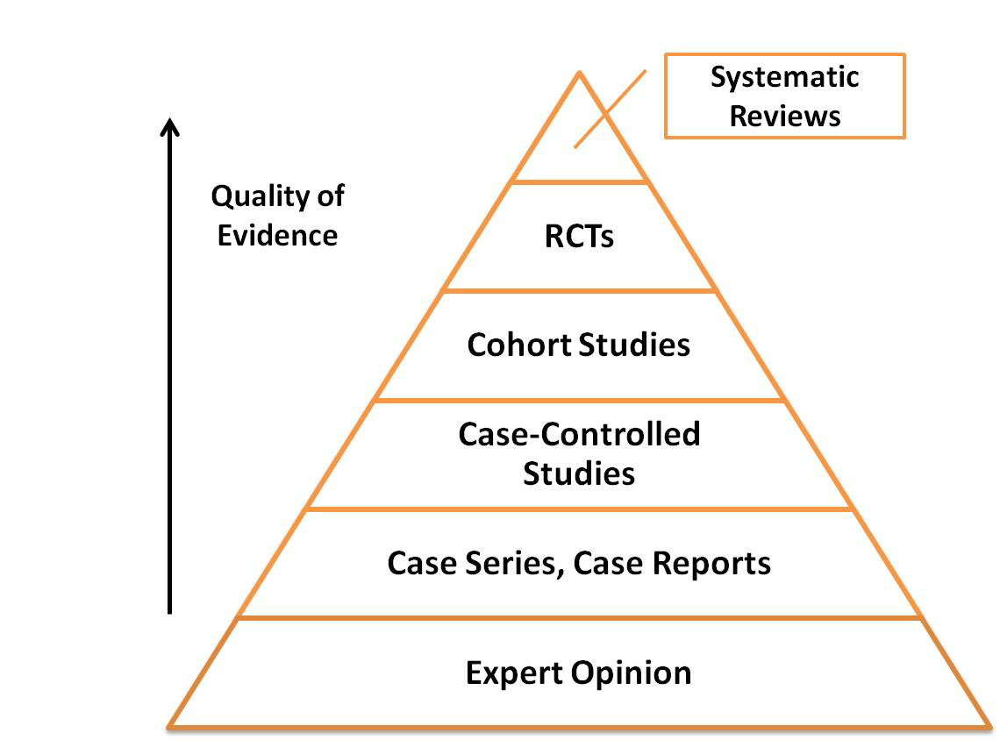

# Rational Drug Choice

90%

| Question | Options | Pre-response | Reading | Final |
| --- | --- | --- | --- | --- |
| The manufacturer of a drug company should not be contacted for information as communication should be kept to a minimum | T/F | F | | F |
| The following is gold standard | Systematic Review Randomised Control Trial Cohort Study Case-control study Expert Opinion | Systematic review | | Systematic Review |
| P-value is the probability that a result is down to chance. What p-value is significant | P < 0.1 P <= 0.05 P < 0.5 P > 0.5 P > 0.05 | P <= 0.05 | | P <= 0.05 |
| False statement about SmPC | Prepared by manufacturer Can be found on medicines compendium Contains information on both licensed and unlicensed indications of a drug Will have details about use of the drug in special circumstances - renal impairment and pregnancy | Contains information on both licensed and unlicensed indications of a drug | | Contains information on both licensed and unlicensed indications of a drug |
| Reviews research from around the world and collates into database of full-text systematic reviews | Cochrane NICE NHS Evidence PubMed Trip Database Docetaxel extravasation | Cochrane | | Cochrane |
| False about formulary | Aims to improve prescribing quality, reduces risk to patients and manages healthcare costs Restricts number of drugs within classes When application is submitted the evidence is reviewed and appraised Cost and efficacy for new drugs are considered for new drugs, as well as comparisons with those already available Formulary can be compared to a guideline, should allow scope for variation and clinical judgement as may not apply to all patients | Compared to guideline | | Compared to guideline |
| MeSH statement is false | used to index abstracts used by Medline will help avoid irrelevant results allow to search by several synonyms restricts searches to systematic reviews only | restricts to systematic reviews only | | restricts to systematic reviews only |
| Which is not part of the audit cycle | Research Set standards Data collection Implement changes Re-audit | Research | | Research |
| Number needed to treat is defined as | Total number of patients who will need to receive intervention is the drug is marketed The number of people who need to be treated with an intervention to see one additional positive outcome compared to the control Number of people who need to participate in a RCT to claim significance Number of people who need to receive the intervention in a RCT to ensure random allocation | Number of people to be treated to see one additional positive outcome | | Number of people to be treated to see one additional positive outcome |
| If your prescribing in evidence-based, it is rational | True/False | True | | False?! Consider patient factors |

## Learning Objectives

- Describe the need for evidence-based practice.
- Explain how it can improve patient safety and outcomes.
- Describe the principles of evidence-based medicine and levels of evidence.
- Explain the difference between Relative Risk Reduction (RRR) and Absolute Risk Reduction (ARR).
- Define and be able to calculate the Number Needed to Treat (NNT).
- Determine if a trial is statistically significant, using P-values and confidence intervals.
- Describe the principles of critical appraisal, and the tools required to review industry advertising critically.
- Seek appropriate evidence and interpret it effectively to aid prescribing decisions.
- Describe how evidence-based medicine is crucial in the development of healthcare policies, protocols and Trust formularies.
- Describe the role of clinical audit and the stages involved.

## Key Points

- "Evidence-based medicine is the conscientious, explicit and judicious use of current best evidence in making decisions about the care of individual patients" [David Sackett].
- Critical appraisal is the process by which evidence is carefully and systematically examined to judge its trustworthiness, value and relevance in a particular context.
- Clinical audit is the systematic process of evaluating clinical practice. It is necessary to assess the quality of care currently provided, to compare current practice with recommended standards, and to drive improvement.
- Hospital (and primary care) formularies aim to improve the quality of prescribing, reduce risks to patients and manage healthcare costs.
- "The next best thing to knowing something is knowing where to find it" [Samuel Johnson].
- The Summaries of Product Characteristics (SPC) are the authorised source of information on indications, dosage, warnings and adverse effects of medicines.
- UK Medicines Information (UKMi) is an NHS pharmacy based service which aims to support the safe, effective and efficient use of medicines by the provision of evidence-based information and advice on their therapeutic use.
- In order to prescribe effectively, patient values and choice, clinical expertise, and evidence-based medicine should all be considered equally.  

## Introduction

> "Evidence-based medicine is the conscientious, explicit and judicious use of current best evidence in making decisions about the care of individual patients"

## Formularies

- Formularies aim to improve the quality of prescribing, reduce risks to patients and manage healthcare costs by restricting the number of drugs within a class or the number of drug classes available for prescribing.
- A formulary is developed by a multidisciplinary team of health professionals. They look at the evidence for a new drug (or new indication) on efficacy, safety, and cost; compare it with other preparations in the formulary, and decide whether it should be added.
- Have you ever considered how much work goes into a formulary application?
- Not all information published about a drug is reputable or reliable, and you should be wary of taking it at face value.  
- We will now go through five simple steps to evidence-based practice. At the end of the section, you should have the knowledge and skills to critically appraise information effectively.

## Evidence Based Practice

| Step | Details |
| --- | --- |
| Define the question | Using PICO classification P = Patient, population, condition, disease, problem I = Intervention C = Comparison O = Outcome |
| Find the best available evidence |  |
| Appraise the evidence critically | Step 1: Establish the relevance See if the study set out to answer the same question as your question. You should be able to work out the original PICO question from the paper's abstract. Step 2: Validity of evidence Once you have established that a study is relevant, you will need to see whether the research is valid. Several checklists can be used, including the Critical Appraisal Skills Programme (CASP). Key questions to ask include: - In a randomised controlled trial, was the allocation to groups genuinely random? - Were all involved in the trial 'masked' to the treatment received? - What statistical tests were used? Were they appropriate? - In a systematic review, was the literature search comprehensive enough? - If you have established that the paper is methodologically sound, you can then turn to the results. |
| Apply the evidence in practice | *Relative Risk Reduction* Relative decrease in the risk of an adverse event in the exposed group compared to an unexposed group. A 30% to 20% reduction is classified as the same as a 3% to 2% of 33% *Absolute Risk Reduction* the difference between the risk of an outcome in the exposed group and the unexposed group. A 30% to 20% reduction is classified as 10% and 3% to 2% classified as 1% *Number Needed to Treat* The Number Needed to Treat (NNT) is the number of people who need to be treated with the intervention to see one additional positive outcome compared to the control. The reciprocal of the ARR Statistical Significance Once you have determined the result of a study, you will want to know whether it is statistically significant. There are two main ways to measure this: *1.) P-value* The P-value is the probability of obtaining the result, or something more extreme, if there is no difference in outcomes between the groups being compared (i.e. the null hypothesis is true). Low P-values indicate a low probability that the outcomes for the groups are the same. The convention is that a P-value of less than 5% or 0.05 is statistically significant. *2.) Confidence interval* Confidence intervals define the range that we are confident contains the true population value. Confidence levels are usually set at 95% I.e. if you repeated a trial many times under exactly the same conditions with an identical sample size, 95% of the calculated confidence intervals would contain the true value. If the range includes the possibility that the control value might be better than the intervention, then the result is not statistically significant.|
| Perform Audit| The final step in evidence-based practice is to audit clinical performance against the evidence and accepted clinical standards. Clinical audit is the systematic process of evaluating clinical practice. |

## Levels of evidence

| Type | Details
| --- | --- |
| Expert Opinion | Often anecdotal and based on poorly reported outcomes. |
| Case Control Studies | The outcomes of individuals exposed to an intervention are compared to matched individuals not receiving the intervention. |
| Cohort Study | A population is either prospectively or retrospectively analysed to see whether any differences affect outcomes.   |
| Systematic Review | A combination of all the evidence for a particular question found within an exhaustive search strategy. |
| Randomised Control Trial | Patients with a particular condition are randomly allocated to an intervention or control group(s), and the outcomes compared. |

## References

- Centre of Evidence Based Medicine. Available online at www.cebm.net
- Clinical evidence. Available online at www.clinicalevidence.com
- Cochrane Collaboration. Available online at www.cochrane.org 
- Medline. Available online at www.ncbi.nlm.nih.gov/pubmed
- National Electronic Library for Health. Available online at www.library.nhs.uk 
- Primary prevention of cardiovascular disease with Atorvastatin in Type 2 Diabetes in Collaborative Atorvastatin Diabetes Study (CARDS): Multicentre randomised placebo-controlled trial. Lancet (2004); 364:685-96.  
- Medicines and Healthcare Products Regulatory Agency. The Blue Guide. Advertising and Promotion of Medicines in the UK. Available online at http://www.mhra.gov.uk/home/groups/pl-a/documents/publication/con2022589.pdf 
- Slavik RS. Information Overload: We Need to Improve the Signal-to-Noise Ratio. The Canadian Journal of Hospital Pharmacy (2009); 62(3): 185-186.