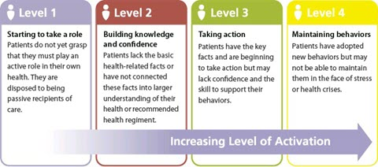

# Shared Decision Making

## Learning Objectives

- Further develop understanding of person centred care principles
- Understand the different elements of a Shared Decision Making conversation
- Understand how the Montgomery Ruling impacts on Shared Decision Making
- Understand how the Mental Capacity Act supports clinicians to respect patient autonomy
- Develop understanding of Self-Management Support principles
- Develop understanding of Motivational Interviewing principles

## Summary Points

- Fostering Person Centred Care in healthcare is everybody's responsibility
- Additional and enhanced communication skills are needed to effectively encourage and support Person Centred Care
- The key Shared Decision Making skills are drawing attention to a problem requiring a decision process, facilitating preference-sensitive decisions, gathering and sharing information and discussing the decision options with reference to the patient's perspective
- The 2015 Supreme Court Montgomery Ruling and the 2005 Mental Capacity Act support Person Centred Care in practice
- Self-management support is an essential part of Person Centred Care and helping people with long term conditions live healthy lives
- A number of different tools are available to support Person Centred Care including Ask 3 Questions, COD (Choices, Options, Decisions), agenda setting and motivational interviewing

## Definitions

### Patient Centred Care

- meets the person’s needs and priorities **before** those of the system or its professionals
- engages people in their care as fully as possible
- support people to take decisions and to be as much in control as possible

## Pathways

Shared Decision Making is appropriate when:

- There is a decision to be made for which a number of valid and realistic options exist
- The options have comparable outcomes which can be demonstrated
- The choice depends upon the preference of the patient

Patients should be encouraged to take into account their values, preferences and beliefs. This is called a ‘preference-sensitive decision’.

Examples of preference sensitive decisions include:

- Breast conserving therapy or mastectomy for early breast cancer
- Hip replacement surgery or exercise/pain relief
- Diet and weight loss or medication in diabetes

### Ask Three Questions

1. What are my options?
1. What are the pro's and con's of each option?
1. How can I get support to help me make the right decision for me?

### Overview of the pathway

1. Highlight that a decision needs to be made
1. Outline different treatments/options
1. Gather information
1. Share information
1. Supporting patient autonomy
1. Recording the decision

### Information Gathering

The information flow needs to be two-way, from patient to clinician and from clinician to patient.

Patients like to receive information in a variety of formats (e.g. discussion, printed, visual images/charts, videos. etc). Developing a repository of information formats is therefore very useful.

### Sharing the information

Sharing information about a treatment option needs to be balanced, unbiased and discussed alongside the patient's views, values, goals and preferences. Questions that can be used to elicit this information are:

- What do you understand about your condition?
- What are your goals and priorities for your treatment?
- Had you any specific expectations about the treatments for you?
- Have you any concerns, everything is important to discuss if it matters to you?

### Recording the descussion

- That you and the patient made a shared decision together, having discussed all the options
- What the patient’s preferences were
- What decision was reached as a result
- check that the patient is satisfied with the level of involvement that they had during the consultation

## Mental Capacity Act

- A person must be assumed to have capacity unless it is established that they lack capacity
- A person is not to be treated as unable to make a decision unless all practicable steps to help him to do so have been taken without success
- A person is not to be treated as unable to make a decision merely because he makes an unwise decision
- An act done, or decision made, under this Act for or on behalf of a person who lacks capacity must be done, or made, in his best interests
- Before the act is done, or the decision is made, regard must be had to whether the purpose for which it is needed can be as effectively achieved in a way that is least restrictive of the persons rights and freedom of action

## Supporting Self Management

### Agenda Setting (using ICE)

Agenda setting is a technique that enables the clinician to focus on what matters most to the patient at that time and to maximise the potential effectiveness of what may be a time-constrained consultation.

The basic principle is to encourage patients to briefly list their concerns or queries at the start of the consultation, in order to establish which are the most pressing and what should be given priority in the discussion.

### Motivational Interviewing

There are four key aspects:

1. Open ended questions
1. Affirmations
1. Reflections
1. Summarising

Motivational interviewing is a communication approach that focuses on exploring and resolving ambivalence to change as a way to help individuals find their own internal motivation.

Motivational interviewing may be helpful in supporting patients to take on more of an active role in deciding what treatment to have, or may encourage patients to adopt healthier lifestyle behaviours.

## References

Montgomery vs Lanarkshire Health Board case
Ottawa Hospital Research Institute. Systematic Review of Patient Decision Aids. View website
Tuckett D, Boulton M, Oban C et al. Meetings between experts: an approach to sharing ideas in medical consultations. London: Tavistock Publications, 1985.
Freeman G, Car J, Hill A. The journey towards patient-centeredness. BJGP 2004 Sep;54(506):651-2.
Rollnick S, Butler C, Kinnersley P et al. Motivational interviewing. BMJ 2010;340:c1900. View document
