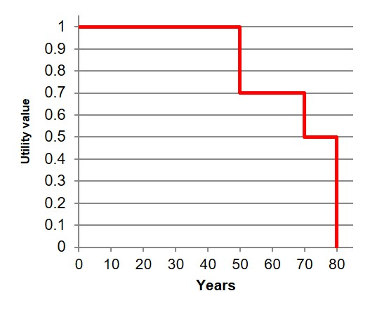

# Health Economic Evaluations

## Learning Outcomes

- Define health economic evaluation types and an explain their differences
- Describe quality adjusted life years (QALYs)
- Understand how the differing assumptions drive results in economic valuations e.g. timescales and discount rates
- Interpret the outputs of an economic evaluation
- Highlight the differences between cost-effective and cost-saving changes

## Key Points

- Economic evaluations are a way of applying economic principles to the real world, and helping to guide good decision making
- There are several key features of economic evaluations that help us to identify when they are being used
- There are different approaches that can be used to undertake an economic evaluation. The most appropriate approach should be used depending on objectives, evidence and scope
- Different economic evaluation types generally differ on how they capture the effects of an intervention. Effects can be expressed in natural units, generic measures of health or money terms
- The perspective, timescale and discount rate should be considered before beginning an economic evaluation

## Economic Evaluations

> Comparative Analysis of alternative courses of action in terms of both costs and consequences

| Term | Feature |
| --- | --- |
| Comparative Analysis | Health economics looks to inform choices, so an economic evaluation must consider multiple options. One choice can only be good value for money relative to something else. |
| Costs and consequences | The primary units to explore are costs and effects (or consequences). These effects can be measures and treated differently, but they must be included. |

## Incremental Change

> difference between observed state to estimated future state

Averages do not give the true cost

| Intervention | Cost | Active Children |
| --- | --- | --- |
| A | 20,000 | 120 |
| B | 30,000 | 150 |

The incremental cost in this case is to answer the question:
> How much more does it cost to "buy" an extra active child?

If we looked at the average cost per child:

- Intevention A £167 
- Intevention B £200

An extra active child is £33 - this doesn't look like too bad a cost.

However if we look at the Incremental changes:

- Incremental cost = £10,000
- Incremental effect = 30 extra children

True cost of an extra child is £333

| Option | Cost | Effect|
| --- | --- | --- |
| Option 1 | £200,000 | 14 lives saved |
| Option 2 | £250,000 | 16 lives saved |

- Incremental cost = 50,000
- Incremental effect = 2 lives 

## Types of Economic Evaluation

| Analysis | Description | Interpretation |
| --- | --- | --- |
| Cost-consequence analysis | compares two or more interventions based on costs and multiple, disaggregated effects. These effects are expressed in natural units. when there is not enough time, capacity or evidence to convert multiple different effects into a single measure, like QALYs or money terms | Results need to be weighed up by considering the impact of subjective values |
| Cost-effectiveness analysis | Similar to cost-consequence but one measure of effet is considered at a time good when one central effect that the interventions are trying to address | Presented as incremental-cost-effectiveness ratio  ICER = Incremental Cost/Incremental Effect |
| Cost-utility analysis | measure of effect is the Quality Adjusted Life Year looking to measure all aspects of health at once | QALYs are built up using utility values. Utility is the measure used by economists to express peoples’ preferences. Perfect health is given a utility value of 1 and death a utility value of zero, with ill health in between. These utility values are multiplied by the number of years spent in that situation. QALYs form a single measure of health that can be used to compare across programmes, even when the health conditions they target are different. | Same as Cost-effectiveness NICE tend to approve ICER of £20,000 |
| Cost-benefit analysis | Effects are given monetary values | Benefit-Cost ratio but doesn't take into account opportunity cost |

### QALY

Full health till 50 years, then develop health conditions at 50 and 70 then die at 80. By working out the area we can calulate the patient has 69 QALYs (50 x 1) + (20 x 0.7) + (10 x 0.5)

PHE look at cost-benefit analysis and put a QALY of £60,000

### Utility Values

| Method | Description | Example |
| --- | --- | --- |
| Time Trade off | If you know years of full health and years of earlier death | If an intervention gives 9 years of full health and 1 year of early death it gives a 0.9 utility value |
| Standard Gamble | Know risk of perfect health and risk of death | If the intervention has a 90% chance of perfect health and 10% chance of death |
| EQ5D questionnaire | Rate health in five domains: Mobility Self-care Usual activities Pain/discomfort Anxiety/depression | Algorithm based utility value |

### Timeframes and Discounting

| Term | Description |
| --- | --- |
| Timeframes | Time allocated to capture costs and effects Results for 5-year and lifetime timeframe can vary |
| Discounting | Future costs and effects are rated lower than those that are realised now This notion is captured by the discount rate. The higher the rate the more quickly values decline over time. A discount rate of 5% would mean that a value one year from now is only worth 95% of what it would if it occurred today. Public Health England follows Department of Health recommendations and uses the discount rate of 3.5% on costs and 1.5% on health benefits. |

## Cost-effective vs Cost-saving

- If something is cost-effective it displays a good relationship between costs and effect. A subset of cost-effective interventions are those that are cost-saving.
- Cost-saving interventions are those that can maintain, or even increase, the desired effects while reducing the costs. These are obvious changes to implement, although there are a number of things to consider:
- When do the costs and savings occur? Changes may be undesirable or unachievable if they require heavy initial investment, with savings only materialising later.
- Are the savings cashable? Predicted savings may not materialise into budget changes if resources can’t be redeployed somewhere else.
- Where do the savings occur? Savings may be seen in another budget holders realm, like within the NHS.

## Effect on Efficiency

| Type | Effect |
| --- | --- |
| Technical Efficiency | Evaluations typically look to understand how things can be done differently within programme areas, balancing costs and effects. This is the hallmark of technical efficiency. |
| Allocative Efficiency | Allocative efficiency can be explored with cost-utility analysis and cost-benefit analysis. When we use common measures of effect, we can compare the results of evaluations in different programmes. If one programme shows a better rate of return, additional resources should be focused there. Because QALYs apply across health, cost-utility analysis can be used to inform allocative efficiency in health. Because money extends to all areas, cost-benefit analysis can inform allocative efficiency across all areas of public sector spending.|

## Assessment 

| Question | Responses | Answer | Correct |
| --- | --- | --- | --- |
| Always use incremental costs because | they ignore what is currently being spent. they are simple to calculate. they represent the true cost you would pay for each unit of effect. all of the above.| True cost | All above |
| Present a cost-consenquence and response is that it is cost-effective | Celebrate Phone commissioning manager to get change made ASAP Ask elected member to write down why they think that Ask for second opinion | Ask for second opinion | Get it in writing |
| Divestment decision will have impact in lower airway infections, obseity and school readiness. Why might cost-effectiveness not be good | Cost effectiveness looks at one outcome at a time Childrens health shouldn't be considered for divestment Cost effectiveness can't be used to compare across programme areas Becuase decision maker doesn't know what value of ICER they think is cost-effective | One outcome at a time | One outcome at at time |
| Jack is 10 years older than Jill. Jack has same total QALYs as Jill | Effects of discounting Jack has been healthier Jill has been healthier Jack has given QALYs to Jill | Jill is healthier | Jill is healthier |
| Evaluation appropriate between different sectors (health vs transport) | Cost-consequence Cost-effectiveness Cost-utility Cost-benefit | Cost-benefit | Cost-benefit |
| Perspective refers to | way results from evaluation are presented which costs and effects are included opinion of decision maker how long into future you look at costs and benefits | how long into future | which costs and effects | 
| Public health interventions are disadvantaged by short evaluation timeframes because | Some philosophers believe time is a social construct short timeframes exclude benefits that occur far into future when intevertions are applied to large populations it takes time to collect data on effectiveness time has an opportunity cost | short timeframes | short timeframes |
|You conduct an evaluation looking to understand if switching from intervention A to B is good value for money. Each year A costs an additional £5,000, and produces 1 extra QALY. These values stay the same for however long you run intervention A. You follow PHE recommendations and so discount costs more heavily than health. As you increase the timeframe of the evaluation, what happens to the cost-effectiveness of intervention A? | Intevention becomes more cost effective Interventions becomes less cost effective Incremental costs and QALYs stay the same so so does cost effectiveness Too little information | Too little information | More cost effective |

## References

[PHE fingertips](https://fingertips.phe.org.uk)

[DoH Policy Appraisal and Health](https://www.gov.uk/government/uploads/system/uploads/attachment_data/file/191503/policy_appraisal_and_health.pdf)

[HM Treasury. The Green Book: appraisal and evaluation in central government. 2013](https://www.gov.uk/government/publications/the-green-book-appraisal-and-evaluation-in-central-governent)

[Simoens S. Health Economic Assessment: A Methodological Primer. 2009. U.S. National Library of Medicine](https://www.ncbi.nlm.nih.gov/pmc/articles/PMC2800325/)

[Health Knowledge. Techniques of economic appraisal (including cost-effectiveness analysis and modelling, cost-utility analysis, option appraisal and cost-benefit analysis, the measurement of health benefits in terms of QALYs and related measures e.g. DALYs)](https://www.healthknowledge.org.uk/public-health-textbook/medical-sociology-policy-economics/4d-health-economics/economic-appraisal)

[Weinstein MC, Torrance G, McGuire A. QALYs: The Basics](https://www.ispor.org/meetings/Invitational/QALY/Paper2revised.PDF)

[Phillips C, Thompson G. What is a QALY?](http://www.vhpharmsci.com/decisionmaking/Therapeutic_Decision_Making/Advanced_files/What%20is%20a%20QALY.pdf)

[York Health Economics Consortium. Perspective](http://www.yhec.co.uk/glossary/perspective/)

[Torgerson DJ , Raftery J. Discounting. 1999. U.S. National Library of Medicine](https://www.ncbi.nlm.nih.gov/pmc/articles/PMC1116731/)

[Public Health England. Health economics: a guide for public health teams. 2017](https://www.gov.uk/guidance/health-economics-a-guide-for-public-health-teams)

[National Information Center on Health Services Research and Health Care Technology (NICHSR). Health Economics Information Resources: A Self-Study Course](https://www.nlm.nih.gov/nichsr/edu/healthecon/04_he_03.html)

