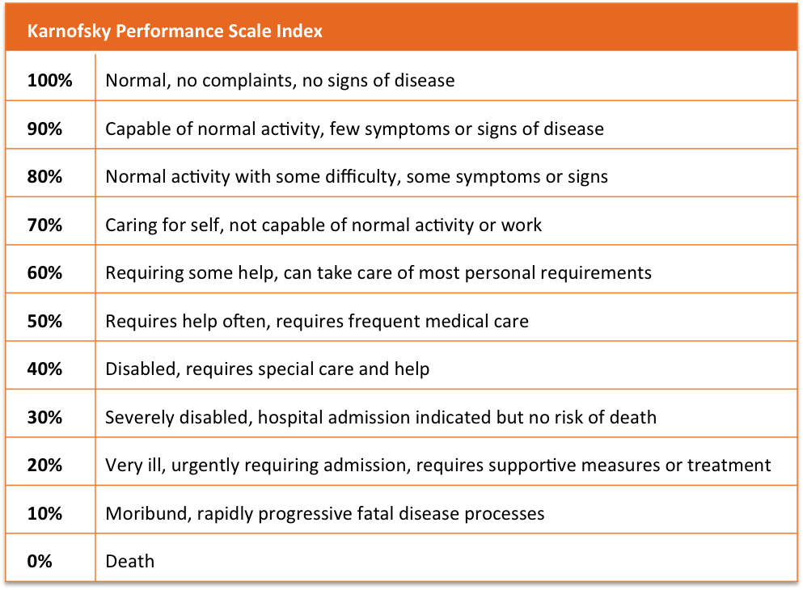
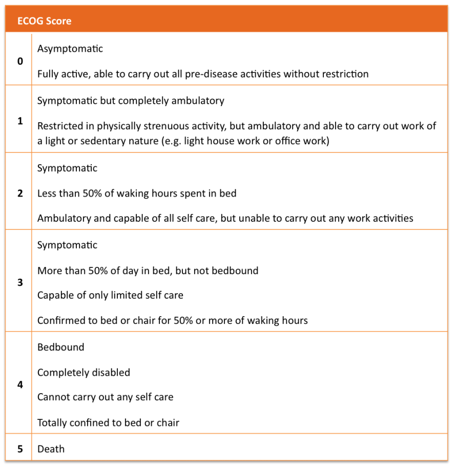
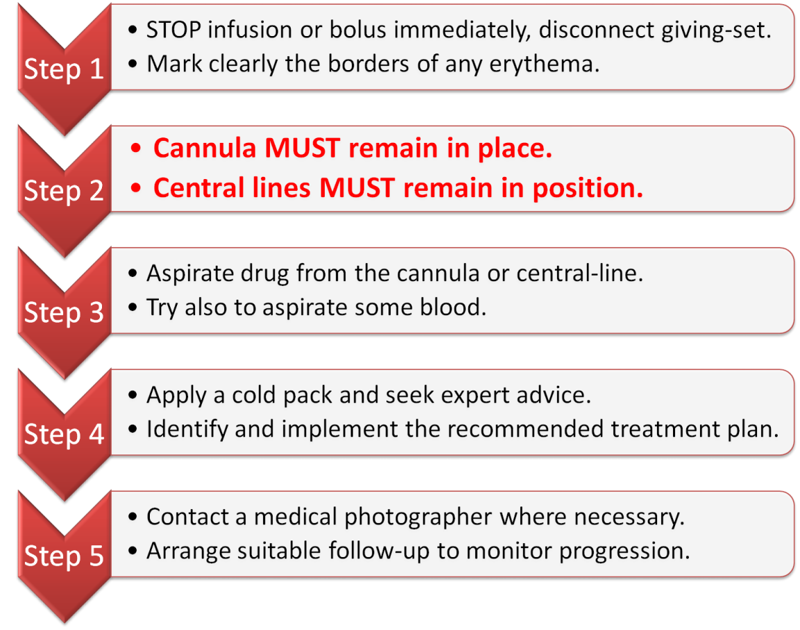

# Managing Complications of Anticancer Therapy

**Split into separate documents**

## Learning Outcomes

- Describe the differences between the main groups of Systemic Anticancer Therapies (SACT).
- Explain the aims of SACT - maintaining the balance between maximised effect and minimised risk.
- Identify and formulate initial treatment plans for common oncological emergencies.
- Identify adverse effects of SACT and formulate simple treatment plans to deal with these complications.
- Know that only those practitioners who are identified on the local intrathecal register may be involved in any process surrounding the prescribing, supply and administration of intrathecal chemotherapy.

## Key Points

- Cancer treatment may have curative intent, aim to prolong life or palliate symptoms. The principle aim of therapy will often influence how SACT is modified in the event of toxicity.
- There is an increasing trend towards the use of oral SACT. Treat these oral therapies in exactly the same way as parenteral treatments.
- Adverse effects of SACT are commonly termed 'toxicities'. Toxicities can be graded according to severity and are often treated with simple supportive therapy.
- Targeted therapy is specific to a tumour site, but toxicities still occur.
- Extravasation and infusion related reactions are complications of parenteral treatment. Deal with these immediately to reduce patient harm.
- The prescribing of SACT is high risk. This can only be done by a specialist, and early discussion of treatment related issues with a haematologist or oncologist is recommended.
- The prescribing, supply and administration of intrathecal chemotherapy is high risk. Only those practitioners appearing on the local Trust 'intrathecal register' of physicians, nurses and pharmacy staff are permitted to take any part in this activity. There are no exceptions to the Trust intrathecal policy.

## Systemic Anticancer Treatments

### Agents that act on the Cell Cycle

> Chemotherapy regimens are designed to exploit agents with different mechanisms-of-action. This approach often secures a more successful treatment outcome as the cell cycle is interrupted at more than one phase

| Cell Phase | Description | Agents |
| --- | --- | --- |
| G0: The Resting Phase | Cells remain in this phase until they are ready to divide. Some cells will never leave this resting phase; other rapidly dividing cells, such as bone marrow, will omit this phase entirely. Cells in the resting phase are not susceptible to the effects of cytotoxic agents, as they are only active in phases G1, S, G2 and M. Conversely all cells that omit the resting phase and continue to divide are highly sensitive to cytotoxic chemotherapy. | Don't expect Cancer cells to be in this phase |
| G1: First Growth Phase | The cell cycle begins at G1. In the first growth phase, cells prepare to divide by synthesising proteins and DNA whilst increasing organelle and cytoskeleton elements. During this phase, cells will continue to perform their normal metabolic function. | **Antimetabolites** This group includes the drugs, methotrexate gemcitabine, fluorouracil and capecitabine (a pro-drug of fluorouracil). Such agents act to inhibit or mimic normal DNA purine or pyrimidine nucleotide bases, inserted into the DNA sequence preventing replication and further cell division. **Anthracyclines** Such as epirubicin and doxorubicin also act in G1 by affecting mitochondrial DNA.  Mitochondrial DNA codes for proteins that are essential for cellular metabolism and energy generation; by damaging this process the cell is unable to remain viable. |
| S:  Synthesis Phase | ‘Chromatin’ is a mass of genetic material found in the cell’s nucleus. In the synthesis phase, chromatins shorten, thicken and condense to form ‘chromosomes’. In S-phase two copies of each chromosome are formed. | **Alkylating agents** Such as cyclophosphamide physically bind the DNA helix, preventing it from being transcribed **Anti-tumour antibiotics**  such as bleomycin cause breaks in the DNA strand that lead to cell death **Platinum compounds**  such as cisplatin bind the DNA nucleotide bases to ‘deform’ the double helix structure, ultimately resulting in irreparable damage **Anthracyclines** interfere with transcription in this phase by binding DNA to prevent it from unravelling and by inhibiting the enzyme topoisomerase-II. |
| G2: Second Growth Phase | RNA and proteins are synthesised A checking function is also performed to ‘proof read’ the newly synthesised genetic material. Errors found at this stage are repaired or a highly orchestrated process of cell death will occur (known as apoptosis). The process of apoptosis usually prevents erroneous material being copied. | Agents that act in G2 inhibit microtubule formation.  They prevent ‘centrioles’ and ‘spindle-fibres’ performing their role, without which the cell cannot divide. **Vinca alkaloids** vincristine **Topoisomerase inhibitors** such as topotecan **Taxanes** such as docetaxel The agents acting in this phase also act in M-phase, and will summarised at the end of the next section|
| M: Mitotic Phase | Mitosis occurs in four stages, prophase, metaphase, anaphase and telophase. Through these stages of mitosis, two identical ‘daughter cells’ will be formed. ‘Centrioles’ – composed of microtubules and formed during interphase – now move to each pole of the cell. Microtubules then radiate from the centrioles as ‘spindle fibres’ that associate with the duplicated chromatin. Finally these ‘chromatids’ are pulled apart by the spindle fibres to opposite poles of the cell. The cytoplasm and cell membrane then cleave to create two cells. Each new cell will either enter the G0 phase or will immediately begin the process of division again. | Agents that act in M phase also inhibit microtubule formation.  They prevent ‘centrioles’ and ‘spindle-fibres’ performing their role, without which the cell cannot divide.  Examples include vinca alkaloids such as vincristine and vinblastine as well as the Taxanes; paclitaxel and docetaxel. |

### Targetted Treatments

| Agents | Target | Actions |
| --- | --- | --- |
| Monoclonal Antibodies | Specific cell surface proteins to deliver their anti-tumour action. This reduces damage to ‘healthy’ cells. | **Trigger the immune system** The mAB attaches to a specific protein on the malignant cells surface which highlights the cell as ‘foreign.’ This in-turn stimulates the immune system to attack the malignant cell. Examples of monoclonal antibodies acting in this manner include Rituximab, which targets the CD20 protein in B-Cell lymphoma and Alemtuzumab which targets the CD52 protein in chronic lymphocytic leukaemia (CLL) **Inhibit protein uptake** mABs are used to target and antagonise growth factor receptors, preventing further cell growth.  Examples of mABs using this mechanism include: Trastuzumab targeting the human epidermal growth factor receptor-2 (HER-2) in breast cancer Bevacizumab which targets the vascular endothelial growth factor (VEGF) in colorectal cancer Cetuximab & Panitumumab which target the epidermal growth factor receptor (EGFR) in colorectal cancer. **Carrier for another anticancer agent** mAB is used to selectively deliver doses of radioactive isotopes or a doses of cytotoxic drug is delivered directly to the intended site of action. Gemtuzumab ozogamicin is one such agent used in acute leukaemia. |
| Protein Kinase Inhibitors | Protein Kinases such as tyrosine-kinase | PKIs inhibit their complex intracellular signal transduction pathways. They deliver important intracellular messages that regulate cellular activity and can stimulate the cell to divide. Malignant changes may result in an over-stimulation of these messaging pathways resulting in uncontrolled cell division and ultimately ‘growth’. Protein kinase inhibitors are used to prevent uncontrolled growth via this mechanism. Recent advances can identify specific mutations in tumour tissue that can then be used as a predictor of patient response. Examples of agents which act via this mechanism include Erlotinib and gefitinib targeting the endothelial growth factor receptor (EGFR) in non-small cell lung cancer Lapatinib used in breast cancer to target ‘HER2’ Sunitinib targeting the Vascular Endothelial Growth Factor Receptor (VEG.F.R) in renal cell carcinoma. The Philadelphia chromosome causes chronic myeloid leukaemia (CML). The BCR-ABL gene encodes for a protein with uncontrolled tyrosine-kinase activity, which leads to over-stimulation of intracellular signalling. Drugs which target this gene are used in the management of CML, and include the tyrosine-kinase inhibitors, dasatinib, imatinib and nilotinib.|
| Proteasome inhibitor | Proteosomes | Proteosomes degrade proteins that regulate cell-cycle progression. Proteosomes cause proteolysis of the endogenous inhibitors of nuclear factors within the cell. Removal of the cell’s own inhibitory mechanisms can lead to uncontrolled production of proteins that promote cell survival, stimulate growth and promote resistance to apoptosis. This mechanism is often the cause of drug resistance as well as relapse and is particularly problematic in multiple-myeloma.  Bortezomib is a novel ‘proteasome inhibitor’, licensed for the treatment of multiple myeloma refractory to at least one standard treatment.|
| m-TOR Inhibitors | The mammalian Target of Rapamycin (known as mTOR) | mTOR is a protein serine-kinase which regulates cell proliferation, motility, transcription and survival. mTOR integrates and processes a number of up-stream cell surface signals with information from  intra-cellular pathways such as nutrient content and metabolic status. This gives mTOR a very important regulatory function in a number of essential cellular pathways. Deregulation of the mTOR pathway is implicated in a number of cancers and is a useful target when inhibition of alternative protein-kinases has failed. The m-TOR inhibitors; everolimus and temsirolimus are currently licensed for use in advanced renal cell carcinoma. The role of everolimus in Acute Myeloid Leukaemia (AML) is currently being investigated, whilst temsirolimus is already licensed for the treatment of relapsed or refractory mantle-cell lymphoma. Inhibition of the mTOR pathway can be exploited in both haematological malignancy and solid Tumour oncology. |
| PARP inhibitors | Poly (ADP-ribose) polymerase | PARP is a protein that detect and initiate an immediate cellular response to metabolic, chemical, or radiation-induced single-strand DNA breaks (SSB) by signaling the enzymatic machinery involved in the SSB repair. | PARP inhibitors are used prevent repair of SSB. If SSB are unrepaired until DNA is replicated (which must precede cell division), then the replication itself can cause double strand breaks to format, causing cell death.  They are used to attenuate in BRCA1 BRACA2 and PALB2 mutations where the homologous recombination repair is impaired. HRR is used to accurately repair harmful breaks that occur on both strands of DNA, known as double-strand breaks. HRR does this though genetic information is exchange between two similar or identical molecules of double-stranded or single-stranded nucleic acids. |

## Treatment intentions

| Modality | Intent |
| --- | --- |
| Neo-adjuvant | Given before the definitive treatment (which is usually surgery or radiotherapy). Its aim is to shrink down the primary tumour and improve outcomes. |
| Adjuvant treatment | Given after RT or surgery. When the risk of micro-metastatic disease is high. This is essentially 'prophylactic' add-on therapy. Treatment is aimed at increasing the percentage chance of 'cure.' Adjuvant chemotherapy is a balance of risk and benefit. Occasionally the added benefit may be small and the risk of harm may outweigh this. |
| Palliative | Life-prolongation, with survival improvements ranging from several months (e.g. lung cancer) to several years (e.g. renal cell cancer). Palliative therapy is aimed at delivering a degree of symptom control and importantly improving quality of life. All active treatment will depend on the patient’s fitness for chemotherapy (performance status).  Often best supportive care is a more appropriate option over ‘active treatment’ in the end stages of life. |
| Radical treatment | Long-term control or cure. Although some treatments will be aggressive and require hospitalisation (common in haematological malignancy) the risk of permanent or long-lasting harm to the patient must be considered. |
| Watchful waiting |  Surveillance and staging of the disease tracks the cancer's growth pattern, which may be an acceptable option when cure is not possible, symptoms are non-existent, life-expectancy is not affected, and the intervention will likely diminish activities of daily living (ADLs).  This strategy is often used when treating prostate cancer, for example. Best supportive care may be offered to control some symptoms such as appetite loss and lethargy when active treatment is considered too high risk. The above strategies all do 'no harm'. |

## Fitness for Treatment

### Performance Status

> Essential oncology assessment tool that is a basic grading of the functional capabilities of the patient, which will of course be a composite of their tumour load, comorbidities and physiological function

#### Karnofsky

#### ECOG

### Toxicities

> Graded using the Common Terminology Criteria for Adverse Events (CTCAE) is used internationally to compare and document chemotherapy toxicity.

Record:
- grade
- baseline 'toxicities'
- duration
- exact timings

## Complications of Malignancy

### Hypercalcaemia

#### Causes

- **Extensive bone destruction** from lytic bone metastases can liberate calcium into the circulation
- **Osteoclastic activity** from ecretion of parathyroid hormone related peptide (PTH-rp) by the tumour

Affect 20% of cancer patients, most commonly seen with multiple myeloma and cancers of the breast, kidney, lung, head and neck.

#### Symptoms

Relate to the rate of increase of serum-calcium concentration, and include:

- Nausea
- Vomiting
- Confusion
- Bone pain
- Polydipsia
- Polyuria
- Clinical signs of dehydration
- Acute renal failure. 

#### Management

Exclude - hyperparathyroidism, sarcoidosis, hyperthyroidism and other rare causes

| Serum-Calcium level mmol/L | Action |
| --- | --- |
| < 2.6 | Normal level |
| 2.6 to 3.2 | Appropriate rehydration. *If necessary* Furosemide can then be used as this loop diuretic enhances calcium excretion by the kidney |
| > 3.2 | Medical emergency and requiring urgent treatment. Aggressive rehydration and treatment with an intravenous bisphosphonate |

## Complications of Chemotherapy

### Tumour Lysis Syndrome

#### Cause

| Pathway | |
| --- | --- |
| Chemotherapy used against chemo-sensitive, bulky tumours | *leads to...* |
| Rapid breakdown of neoplastic cells, releasing intracellular ions and metabolic by-products | *which causes...*|
| Hyperkalaemia, Hyperuricaemia, Hyperphosphataemia, and Resultant hypocalcaemia | *resulting in...* |
| Acute Kidney Injury (AKI), acute cardiac arrhythmias and the risk of sudden death |

#### Management

| Prevention by |
| --- |
| Adequate pre-hydration starting 24 hours before chemotherapy. |
| Assessment of adequate urine output. |
| Prophylactic allopurinol or rasburicase to prevent hyperuricaemia. |

| Treatment *refer to local guidelines* |
| --- |
| Maintain  high urine output with hydration and fluid balance monitoring. |
|    Rasburicase may be initiated to rapidly clear uric acid. |
|    Treat symptomatic hypocalcaemia only (leave if there are no symptoms). |
|    Treat hyperkalaemia (e.g. insulin (with glucose) will shift excess potassium to the intracellular compartment – preventing arrhythmia). |
|    Consider renal dialysis where fluid overload, hyperkalaemia, hyperuricaemia, hyperphosphataemia or hypocalcaemia do not respond to treatment |

### Neutropenia and Sepsis

| Neutropenia | Neutropenic Sepsis |
| --- | --- |
| Grade 4 (CTCAE) neutropenia is defined as a neutrophil count of less than 0.5 x109/litre. Fever is temperature of 38°C for more than one hour. | Evidence of end organ dysfunction (hypotension, tachycardia, hypoxia, poor urine output, confusion). |

#### Management

*In accordance with local guidelines*

| Investigation should not delay treatment |
| --- |
| Immediate resuscitation if required |
| **Broad Spectrum Antibiotics** |
| Detailed history, especially establishing details about systemic therapies and timings. Neutrophil nadirs are most common about 7-14 days post treatment |
| Examination should include assessment of potential sites of infection (chest, urinary tract, mouth, central lines, catheter sites, perineal and perianal regions) however only the minority of patients will have a focus of infection identified |
| Investigations should include full blood count, clinical chemistry, blood, urine and sputum cultures where appropriate, and appropriate radiology. |

### Mucositis

> Pain, difficulty chewing, talking and swallowing  Oropharyngeal candidiasis can lead to more severe sequalae.

#### Prevention

- Anticipate symptoms: high risk procedures e.g. head/neck radiotherapy, bone marrow and stem-cell transplantation.
- Review drug history for any dry mouth causing medications (e.g. tricyclic antidepressants, opioid analgesics and antihistamines)
- Prescribe prophylactic mouth care in advance (as per local protocols).
- Recommend non-pharmacological management; soft foods, soft bristle (child's) toothbrush, temporary removal of dentures, carbonated drinks, and cryotherapy (sucking ice-cubes).

| | |
| --- | --- |
| Prophylaxis | Antibacterial mouthwash (e.g. chlorhexidine 0.2%) anaesthetic/anti-inflammatory spray or mouthwash (e.g. benzydamine 0.15%) saline mouthwashes. |
| Prophylaxis | Oral barrier gels (e.g. Gelclair®) these coat the oral mucosa, which may reduce pain and ameliorate mild symptoms. |
| Treatment | Saline/bicarbonate based mouthwash. |
| Treatment | Topical antifungal where appropriate (e.g. nystatin oral rinse).  A systemic antifungal should be used in persistent cases or in severely immunocompromised patients - where prophylactic use may be advisable. |

Advise patients to use mouthcare after meals to avoid mechanical removal of the agent.  Furthermore, each mouth rinse should be separated by at least 10 minutes to prevent direct removal by the subsequent solution. Agents that 'coat' the oral mucosa should be used last.

### Nausea and Vomiting

> Cause of CINV is chemical stimulation of the central nervous system (CNS), specifically the 'chemoreceptor trigger zone' (CTZ) of the area postrema. This in-turn leads to activation of the 'emetic-centre' in the reticular formation.

| Onset | Time to onset |
| --- | --- |
| Acute | 24 hours after treatment start |
| Delayed | Up to 5 days |

**Management** Pre-emptive combination anti-emetic therapy based on emetogenic potential of SACT regimen

### Diarrhoea

> Risks of dehydration

| Management Approach | Details |
| --- | --- |
| Proactive | Provide patient education. Your patient needs to know what to expect so they can react promptly to prevent further complications. Provide patient alert cards, particularly for high-risk and immune-oncology treatments. Prescribe in anticipation of diarrhoea (where appropriate), limit supply of 'PRN' self-management treatments initially. Self-management plans must have a 'ceiling' duration, where seeking medical advice is triggered. Consider Dose reduction at next cycle|
| Reactive | Establish clearly the treatment / SACT regimen. Auto-immune colitis in patients on immune-oncology regimens requires prompt treatment including high dose intravenous steroids. Exclude an infective cause, bearing in mind that diarrhoea and neutropenia may co-exist, increasing the risk of Gram-negative infection. Initiate treatment, which should involve fluid resuscitation, an anti-diarrhoeal, situation specific treatments and temporary cessation of the causative agent(s). Access specialist advice early. |

### Constipation

> uncomfortable, painful, and distressing for the patient. In the more severe cases, it may lead to urinary retention, anal fissure and bowel obstruction.

| Management | Details |
| --- | --- |  
| Lifestyle | Light exercise such as walking (within tolerance). Increased non-alcoholic fluid intake (in the absence of contraindication). Increase dietary fibre (fruit, vegetables, cereals) and bulking agents (bran). |
| Medication | Prescribe in anticipation of constipation (e.g. vincristine is known to cause constipation, abdominal cramps, paralytic ileus and intestinal perforation). Prescribe laxatives 'as required' in advance of the first symptom. |

## Extravasation

> leakage or inadvertent administration of an agent intended for intravenous use into tissue surrounding the vein

### Causes

- Cannula passes through lumen of blood vessel so infused drug enters tissues rather than bloodstream
- Cannula 'nicks' blood vessel wall casusing leakage of drug to adjacent tissues
- Leakage through pre-existing damage from previous cannulation

### Classification

Tissue necrosis potential of drug on tables

### Recognition an extravasation injury

Inform the patient how to recognise extravasation and the need for urgent medical attention

- Usually be noticed by the patient, and include sensations of pain, stinging and burning.
- Erythema at the site of the injury (which may be distant from the site of administration).
- The area of erythema should be clearly marked as soon as it is noticed – as a means of assessing improvement/deterioration.  
- Blistering may occur and the skin colour may change in appearance.
- Induration occurring in the initial stages of extravasation is a predictor of later ulceration.  A black scab ‘eschar’ may form, which when removed or sloughed may reveal an ulcerating cavity.  Ulcers are typically necrotic in nature.

### Management

A multi-disciplinary team should assess the injury, including at-least two of the following: chemotherapy trained nurse, a haem-oncology doctor, haem-oncology pharmacist, a plastic-surgeon. It may be necessary for a medical photographer to attend to document the initial injury. approach initial treatment

### Prevention

- Fresh cannula for SACT administration
- After cannulation, the integrity of the cannula should be tested for 'flashback' of blood into the giving set.
- IV boluses to be piggy-backed to ensure dilution

## Infusion related

### Causes

- Carboplatin
- Irinotecan -  Anti-cholinergic reactions: acute diarrhoea, abdominal cramping, sweating and blurred vision
- Oxaliplatin
- Monoclonal antibodies (rituximab, trastuzumab)
- Taxanes (docetaxel, paclitaxel) - also excipients alcohol
- Dacarbazine - after light exposure
- Cold infusions
- Local vasoconstriction

## Auto-Immune Reactions

> Caused by Immunotherapy

| Broad Mechanism | Agent |
| --- | --- |
| 'Switch on' | Ipilimumab |
| 'Switch off the brakes' remove the natural self-regulation processes of the immune system | Pembrolizumab Nivolumab |

### Symptoms

- Colitis
- Endocrinopathies (e.g. hypophysitis, diabetes mellitus, hyperthyroidism)
- Hepatitis
- Guillian-Barré syndrome
- Haemolytic anaemia
- Myositis - muscle inflammation
- Nephritis
- Pancreatitis
- Pneumonitis
- Toxic epidermal necrolysis

### Treatment

- Systemic high-dose corticosteroids +/- other immunosuppressants
- Interruption or permanent discontinuation of the immuno-oncology agent(s).

