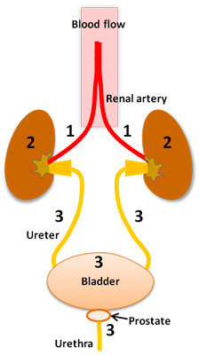
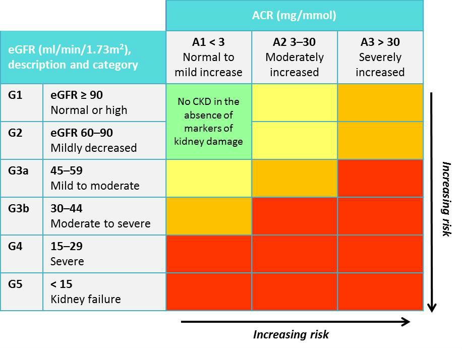

# Prescribing in renal dysfunction

100%

| Question | Options | Pre-response | Reading | Final |
| --- | --- | --- | ---| --- |
| NSAIDs are nephrotoxic because | promote renal vasoconstrictive cytokines inhibit prostaglandins cuasing vasoconstriction and renal hypoperfusion volume depletion and hypovolaemia directly nephrotoxic causing acute tubular necrosis metabolites are directly nephrotoxic | inhibit prostaglandins | | |
| Unlikely to affect serum K+ conc | Amiloride Amlodipine Eplerenone Macrogol Salbutamol | Amlodipine | | |
| eGFR can be used to estimate renal function in which | 20 yo anorexic 85 yo frail and thin no PMH 28 yo pregnant in 2nd trimester 40 yo morbidly obsese 50 yo man with glomerulonephritis | 50 yo | | |
| ACEi in CKD | ACEi are directly nephrotoxic should be continued in reduced dose in CKD should be avoided in bilateral renal artery stenosis concomitant diuretics should be avoided Monitor Potassium due to hypokaemia risk | bilateral renal stenosis | | |
| Fluid balance in AKI. Hypovolaemia and HCO3 18mmol/L. Which fluid | Albumin Sodium bicarbonate 1.26% NaCl 0.9% KCl 0.15% Gelofusine | Bicarb | | |
| Fluid overload | Add furosemide add metolazone add spiro increase indapamide stop indapa and switch to furosemide | switch to furosemide | | |
| Cipro eGFR 22ml/min incorrect statement | Dose adjustment can be based on eGFR if appropriate for that patient Extended dose interval may be recommended for some drugs Dose adjustment likely for drugs with long half life Monitor serum Cipro level to avoid toxicity Dose adjustments are in BNF | Cipro level | | |
| Ideal drug for kidney disease, which characteristic to avoid | inactive metabolites narrow therapeutic window no effect on CYP disposition of drug unaffected by fluid balance | narrow therapeutic window | | |
| To manage hypekalaemia, calcium gluconate... | stabilises myocardium corrects acidosis increased cellular potassium update block GI uptake promote renal tubule potassium elimination | stabilise myocardium | | |
| Adverse effect of statin that is nephrotoxic | Hepatorenal syndrome Accelerated Hypertension Non-dilated obstructive nephropathy Rhabdomyolysis Septicaemia | Rhabdomyolysis | | |

## Learning Outcomes

- Explain how impaired renal function alters the pharmacokinetics of drugs.
- Assess renal function and the limitations of the available methods.
- List which medicines and agents can be nephrotoxic and how these can cause AKI.
- Identify common medicines that need dose adjustment in kidney disease.
- Demonstrate effective management of:
  - (a) intravenous fluid therapy
  - (b) hyperkalaemia
  - (c) antihypertensive therapy and (d) diuretics in kidney disease.
- Know where to find information to guide prescribing in kidney disease.

## Key Points

- Nephrotoxic drugs often cause renal damage.
- Identifying common drug causes (e.g. NSAIDS, ACE inhibitors, and aminoglycosides) and withdrawing them is vital in the management of renal injury.
- Drug doses often need to be changed if eGFR or creatinine clearance (ClCr) falls, or in the presence of oliguria.
- Patients with hypertension and renal dysfunction need effective, tailored antihypertensive therapy.
- Intravenous fluid therapy should correct volume depletion, while avoiding overcorrection and fluid overload.
- Appropriate diuretic management is important.
- Hyperkalaemia is common in renal dysfunction, and treatment is needed to control it.
- ACE inhibitors are usually beneficial in CKD, particularly in patients with proteinuria and especially in patients with diabetes, but they are dangerous if the patient is volume depleted or hyperkalaemic.

## Acute Kidney Injury

### Causes

| Number | Cause | Description |
| ---| --- | --- |
| 1 | Prerenal | reversible impairment of renal function from relative hypovolaemia or hypoperfusion. Any condition reducing renal perfusion can potentially impair renal function.|
| 2 | Renal | damage within the kidney could result from more severe ischaemia, sepsis, inflammation, or toxicity (renal cells are very sensitive to inflammatory or ischaemic injury).|
| 3 | Postrenal | obstruction to urine outflow (e.g. enlarged prostate in men) causes a damaging 'back pressure' within the kidney.|

### Staging

| Stage | Details |
| --- | --- |
| 1 | Creatinine rise of 26 micromol/litre or more within 48 hours; or Creatinine rise of ≥ x 1.5 from baseline in 7 days ; or Reduced urine output of < 0.5 ml/kg/hour for more than 6 hours.|
| 2 | Creatinine rise of ≥ x 2 from baseline; or Reduced urine output of < 0.5 ml/kg/hour for 12 hours or more.|
| 3 | Creatinine rise of ≥ x 3 from baseline within 7 days OR Creatinine rise to ≥ 354 micromol/litre with either: Acute rise in creatinine of ≥ 26 micromol/litre within 48 hours or ≥ 50% rise from baseline within 7 days OR Urine output of < 0.3 ml/kg/hour for 24 hours OR Anuria for 12 hours OR Any requirement for renal replacement therapy.|

### Optimal Prescribing

- Correct hypovolaemia;
- Minimise renal hypoperfusion (often caused by drug therapy);
- Treat other causes, such as sepsis;
- Avoid the use of (or withdraw) nephrotoxic agents; and
- Consider drugs that are renally excreted and may need adjustment.

### Drug Induced Nephrotoxicity

| Drug / Class | Details |
| --- | --- |
| Aminoglycosides | are directly nephrotoxic, causing acute tubular necrosis. |
| Amphotericin | is directly nephrotoxic. The use of newer liposomal formulations can still result in nephrotoxicity. |
| Cytotoxic chemotherapy | e.g. cisplatin, which has been associated with renal tubular damage. |
| Diuretics | can lead to volume depletion. |
| Immunosuppressants | ciclosporin and tacrolimus cause renal vasoconstriction producing ischaemia. |
| Lithium salts | can cause tubulo-interstitial damage and chronic kidney disease with long-term use. However, it should only be suspended if there is known lithium overdose or toxic levels, due to its importance as a treatment for bipolar disorder. If the situation is unclear, discuss its use with a specialist. |
| NSAIDs/COX-2 inhibitors | renal blood flow often relies on prostaglandins. NSAIDs and cyclooxygenase-2 inhibitors reduce prostaglandin synthesis, and cause renal hypoperfusion, and AKI. |
| Radiocontrast media | a high ionic load can produce renal vasoconstriction leading to ischaemia. |
| Other nephrotoxic agents | Synthetic agents: insecticides, herbicides. Naturally occurring agents: alkaloids from plants/fungi, reptile venoms (all rare), cocaine. |

### Pathological Causes

| Cause | Details |
| --- | --- |
| Hypoperfusion | reduces oxygen and nutrient supply to the kidney. |
| Sepsis | endotoxins and inflammatory mediators from infection can damage the renal vascular endothelium resulting in thrombosis. |
| Rhabdomyolysis | myoglobin released from damaged muscles precipitates in renal tubules and also reduces blood flow in the outer medulla. |
| Hepatorenal syndrome | patients with end-stage liver disease often have renal vasoconstriction. |

### Glomerular Filtration Rate

eGFR is only good in certain scenarios, Cockroft and Gault is more appropriate when:
- in AKI
- Older adults
- Patient on a toxic medicine
- Patients at extremes of muscle mass
- Patients on a medicine with a narrow therapeutic index
- Patients on direct-acting oral anticoagulants (DOACs)

> Glomerulus filters plasma from blood into glomerular filtrate

| Arteriole | Mediated by | Actions |
| --- | --- | --- |
| Afferent | Prostaglandins | maintain renal blood flow and GFR, especially under conditions of reduced effective circulating volume (e.g. dehydration, cardiac failure, cirrhosis). |
| Efferent | Angiotensin-II | produced by the renin-angiotensin system in response to hypovolaemia or reduced renal perfusion (e.g. with reno-vascular disease). It causes efferent arteriolar vasoconstriction - using the above analogy it reduces drainage from and maintains pressure in the bath, in the face of reduced inflow. |

### Monitoring

#### Fluid Balance

| Checks | | 
| --- | --- |
| Pulse - supine and upright (where possible). You may need to sit the patient up in bed if they are unable to stand. | A rise in heart rate on standing of more than or equal to 30 beats per minute is one of the more sensitive indicators of hypovolaemia |
| Blood pressure - supine and upright. | |
| Arterial oxygen saturation. | |
| Pulmonary oedema | examine for tachypnoea, fine bilateral basal inspiratory crackles, chest X-ray signs. |
| Fluid overload | check for pitting ankle and sacral oedema. Check the patient's weight daily (rising daily weights are a very useful indicator of fluid overload). |

#### Urine Dipstick

Important to exclude a finding of proteinuria and haematuria.

### Fluid Replacement

Fluids:
- Sodium chloride 0.9% is an appropriate intravenous fluid in AKI.
- Sodium bicarbonate 1.26% is a good alternative if the patient has:
 - AKI with hypovolaemia 
 - and a metabolic acidosis (a serum bicarbonate of less than 20 mmol/litre).

| Phases | Details |
| --- | --- |
| Volume Repletion | Guided by the volume status, aim to correct any relative or absolute hypovolaemia. In this phase often repeated fluid ‘challenges’ with infusion of 250 to 500 ml or more of sodium chloride 0.9% may be the best |regimen. Monitor vital signs, including urine output, in an acute or high dependency environment.|
| Maintenance | When volume repletion has been achieved, adjust prescribed regimens to take account of fluid balance if the patient requires continuing intravenous fluid therapy. Reduce the rate of infusion, more so if the patient remains oliguric. Iatrogenic fluid overload risks pulmonary oedema and has recently been associated with increased mortality in AKI. 'Reflex' prescribing of up to 3 to 4 litres of intravenous fluids per day without proper fluid balance assessment is wrong and risks disaster! Intravenous colloids (e.g. Gelofusine®  or albumin) do not provide any additional benefit for volume expansion and renal recovery compared with sodium chloride 0.9%.|

## Prescribing in Chronic Kidney Disease

### Staging of CKD

CKD is classified according to two parameters: the eGFR and the Albumin: Creatinine ratio (ACR) (mg/mmol).
 
In the classification table, 'G' denotes the eGFR, which is based on the previous method of classification of five categories (G1-G5); and 'A' denotes the ACR (A1-A3).

### Drugs

| Classification | Details |
| --- | --- |
| Loop Diuretics | may reduce fluid overload and hyperkalaemia in CKD. Only consider diuretic therapy in fluid overload and/or hyperkalaemia or hypertension. If they are used in other patients, subsequent dehydration could result in a pre-renal state. |
| ACEi | ACE inhibitors and Angiotensin-II Receptor Blockers (ARBs) are not directly nephrotoxic and can be used in most patients with kidney disease with obvious benefits. However, serious hypotension can occur on initiation in susceptible patients with renal impairment - those prescribed high dose diuretic treatment for fluid overload are at particular risk (because of relative dehydration and therefore poor renal perfusion). |

### Hyperkalaemia

| Factor | Details |
| --- | --- |
| Causes | Urinary excretion of potassium is reduced. Intracellular potassium may be released. |
| Risks of not managing | precipitation of cardiac arrhythmias, and if left untreated, asystolic cardiac arrest. |
| Drugs that can precipitate | Contain potassium - e.g. laxatives (Movicol®, Klean-Prep®, Fybogel®). Act to retain potassium in serum - ACE inhibitors, ARBs, potassium-sparing diuretics, NSAIDs. Prevent intracellular buffering of potassium - beta-blockers, digoxin.|
| Treatment | 1. Protect the heart - stabilise the myocardium. With Calcium Gluconate 2. Reduce serum-potassium concentration - drive potassium into the cells. Nebulised Salbutamol or Insulin 3. Rid the body of excess potassium - stop drugs contributing to hyperkalaemia, correct acidosis, and reduce potassium intake (Resins).|

## References

- Joint Formulary Committee. British National Formulary (online) London: BMJ Group and Pharmaceutical Press.  Prescribing in renal impairment. Available online at https://bnf.nice.org.uk/
- Medicines and Healthcare products Regulatory Agency. Drug Safety Update. Prescribing medicines in renal impairment: using the appropriate estimate of renal function to avoid the risk of adverse drug reactions. Available online at https://www.gov.uk/drug-safety-update/prescribing-medicines-in-renal-impairment-using-the-appropriate-estimate-of-renal-function-to-avoid-the-risk-of-adverse-drug-reactions
- National Confidential Enquiry into Patient Outcome and Death (2009). Adding insult to injury. A review of the care of patients who died in hospital with a primary diagnosis of acute kidney injury (acute renal failure). Available online at http://www.ncepod.org.uk/2009report1/Downloads/AKI_report.pdf
- National Institute for Health and Care Excellence (NICE) (2014). Chronic Kidney Disease. Early identification and management of chronic kidney disease in adult in primary care and secondary care. (Online).  Available online at http://www.nice.org.uk/guidance/cg182
- National Institute for Health and Care Excellence (NICE NG 136) (2019). Hypertension in adults: diagnosis and management. (Online).Available at https://www.nice.org.uk/guidance/ng136
- National Institute for Health and Care Excellence (NICE NG 148) (2019). Acute kidney injury: prevention, detection and management (Online).Available at https://www.nice.org.uk/guidance/ng148
- Ostermann, M., & Joannidis, M. (2016). Acute kidney injury 2016: diagnosis and diagnostic workup. Critical Care, 20, 299.
- The Renal Drug Handbook: The Ultimate Prescribing Guide for Renal Practitioners, 4th edition. Edited by C Ashely and A Dunleavy; Radcliffe Publishing, London, 2014.
- Think Kidneys. Available online at https://www.thinkkidneys.nhs.uk/aki/
