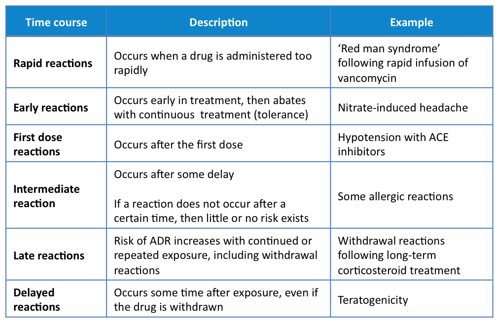

# Adverse Drug Reactions

| Question | Options | Pre-response | Reading | Final |
| --- | --- | --- | --- | --- |
| Yellow Cards | Pt Consent Required Patients Cannot report Run by BNF Confirmed ADRs only ADRs associated with unlicensed medicines can  | Unlicensed | Unlicensed | Unlicensed |
| ADRs very common | 10 20 30 40 50  | 50 | 10 | 10 |
| Type B reaction | Pharmacology Common High mortality Predictable Dose related | Pharmacology | High Mortality | High Mortality |
| ADR when rapid | Anaphylaxis Penicillin Angioedema with ACEi Red man vanc Hyponatremia with furosemide Osteo with pred | vanc | vanc | vanc |
| Avoided G6PD deficiency | low aspirin cipro diclofenac paracetamol warfarin | diclofenac | cipro | cipro |
| suspicion | return of symptoms no prior history of ADRs interactions no known plausible mechanism appearance before drug | appearance before drug | appearance before drug | appearance before drug ingested |
| not yellow card | medication error faulty device herbal deliberate overdose poor clinical practice | poor clinical practice | poor clinical practice | poor clinical practice |
| should report | morbilliform rash 2yr old amox drowsiness 10yr old post op morphine migrane 17yr microgynon oral thrush 12yr fluticasone inh vomitting 14yr valproate | morbilliform rash | | valproate - black triangle |
| digoxin tox | A B C D E | B | A | A |
| not ADR | patient suspected routinely collected by EMIS etc clinical trial causally-linked to drug limited harm extremely rare | causally-linked | | collected by DATIX |

## Learning Outcomes

- Define an ADR and the classification of ADRs
- Identify susceptibility factors that place patients at increased risk of ADRs
- Discuss the concepts of pharmacovigilance and its importance for public health
- Explain the role and function of the Yellow Card scheme
- Identify sources of information on ADRs

## Key Points

- Adverse drug reactions (ADRs) are common and often preventable.
- ADRs cause significant morbidity and mortality, as well as being a financial drain on the NHS.
- ADRs can be classified on the basis of their dose-relationship, their time-dependency and patient susceptibilities.
- Post-marketing surveillance of ADRs for both newly-licensed drugs and well-established drugs is essential.
- The Yellow Card scheme receives reports about  suspected ADRs in the UK.
- To submit a valid report to the scheme, you need to provide four items of information: 
  - an identifiable patient
  - an identifiable reporter
  - a suspect reaction
  - a suspect drug.
- It is an important part of your role to provide clear, accurate, and relevant information about potential ADRs to your patient.

### Definition

> "An appreciably harmful or unpleasant reaction, resulting from an intervention related to the use of a medicinal product, which predicts hazard from future administration and warrants prevention or specific treatment, or alteration of the dosage regimen, or withdrawal of the product".

> 'Use of a medicinal product within the terms of the marketing authorisation as well as from use outside the terms of the marketing authorisation, including overdose, misuse, abuse and medication errors, and suspected adverse reactions associated with occupational exposure.'

## Rawlins and Thomson classifications

| Type | Name | Features | Example |
| --- | --- | --- | --- |
| A | Augmented | Dose-related Common, predictable Related to the pharmacology Unlikely to be fatal | Digoxin Toxicity Opioid Constipation |
| B | Bizarre | Not dose-related (within the therapeutic dose range) Uncommon, unpredictable Not related to the pharmacology Often fatal | Penicillin hypersensitivity Malignant hyperthermia and hepatitis caused by anaesthetic agents |
| C | Chronic | Uncommon Related to cumulative dose Time-related | Suppression to the hypothalamic pituitary adrenal axis with long-term corticosteroids |
| D | Delayed | Uncommon Usually dose-related Occurs or becomes apparent some time after use of the drug | Carginogenesis |
| E | End of Treatment | Uncommon Occurs soon after withdrawl of the drug | Opioid withdrawal |
| F | Failure | Common Dose-related Often caused by drug interactions | Failure of the oral contraceptive in the presence of an enzyme inducer Failure of therapeutic effect in patients taking anticoagulants leading to stroke |

## DoTS

| | Features | Examples |
| --- | --- | --- |
| **Dose**: Hypersusceptibility Collateral Toxic |  Less than therapeutic At therapeutic Higher than therapeutic | |
| **Time**: Dependant Independant |  Depends on timing (rapid, early, first, intermediate, late and delayed) Occur at any time (i.e. bleeding with Warfarin) | |
| **Susceptibility**: Immunological reactions (e.g. allergies) Genetics (e.g. G6PD deficiency) Age (e.g. the elderly and children) Sex (e.g. female) Physiology (e.g. pregnancy) Exogenous (e.g. other drugs the patient may already be taking, foods, temperature) Disease states affecting the patient (e.g. renal dysfunction, liver disease, which may influence prescribing) |  |

### Susceptibilities

| Susceptibility | Example | 
| --- | --- |
| Age | Older Adults : Co-morbidities, Altered Metabolism/Excretion, Interactions Children: Developmental, Distribution (Increased body water, reduced albumin), Immature Blood Brain Barrier |
| Diseases | Congestive cardiac failure Diabetes mellitus Chronic pulmonary disease Rheumatological and malignant disease |
| Exogenous | Interactions | 
| Genetics | Ethinicity: ACEi Angioedema in Afro-Caribbean Pharmacogenetics: HLA-B*1502 skin reactions in antiepileptics G6PD haemolytic anaemia: Anti-malarials (e.g. primaquine and chloroquine), Nitrofurantoin, Quinolone antimicrobials (e.g. ciprofloxacin), Rasburicase, Sulphonamides (e.g. co-trimoxazole) Porphyrias |

## Identification

Suspicious factors:

- The time relationship between drug exposure and the subsequent event
- Clinical and pathological characteristics known to be related to drug use, but not the disease processes
- Pharmacological plausibility
- The drug is known to cause the suspected ADR
- Concomitant medication, which could be an alternate cause, or could interact
- Underlying and concurrent illnesses, which could cause the event
- The symptoms improve after reducing or stopping treatment (de-challenge)
- The symptoms return on reintroducing treatment (re-challenge)
- The patient has had a similar experience in the past

## Monitoring

| Thing to monitor | Effect |
| --- | --- |
| Standard blood test | Be vigilant in those with co-morbidities, especially renal failure. Monitor electrolytes carefully in those taking more than one medicine that can alter renal excretion of sodium and potassium. |
| Clozapine | Risk of agranulocytosis. Mandatory monitoring of white blood cells, platelets and neutrophils has led to over 90% of fatal agranulocytosis cases being prevented. |
| Methotrexate | Risk of blood dyscrasias with methotrexate, a full blood count, renal and liver function tests are recommended at baseline, weekly until therapy has stabilised and then every 2—3 months thereafter. |
| Warfarin | INR |
| Plasma Drug Concentration | Narrow therapeutic index drugs: Lithium, Vancomycin |

## Pharmacovigilance

### Completing Yellow Card

Need:

- An identified patient (e.g. hospital number)
- A suspected reaction
- A suspected drug
- A reporter

### Information

#### Drug Analysis Profiles

Issues:

- They only contain reported reactions (95% of ADRs are not reported)
- There is no data on the number of prescriptions issued (so incidence cannot be calculated)
- They are 'suspected reactions', so no causality can be implied
- Comparison of different drugs is not possible, due to biases in reporting rates

#### Occurence

| | Percentage |
| --- | :---: |
| Very Common | >10% |
| Common | >1% but <10% |
| Uncommon | >0.1% but <1% |
| Rare | >0.01% but <0.1% |
| Very Rare | <0.01% |